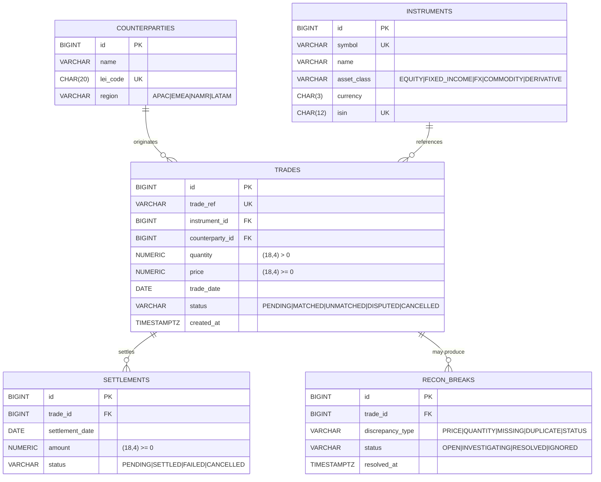

# TradeFlow — Entity Relationship Diagram (TICKET-I002)

> This ER diagram models the core entities for the trade reconciliation system.

## Final Diagram

## Design decisions
| Decision | Why |
|---|---|
| `NUMERIC(18,4)` for quantity + price | IEEE-754 doubles cause silent rounding errors on money. |
| FKs everywhere | DB enforces referential integrity cheaper + safer than app-layer checks. |
| `recon_breaks` (not `recon_results`) | A break is a *negative* finding worth tracking. |
| `CHAR(20)` for `lei_code` | LEI is exactly 20 alphanumerics — fixed width is cheaper + signals intent. |
