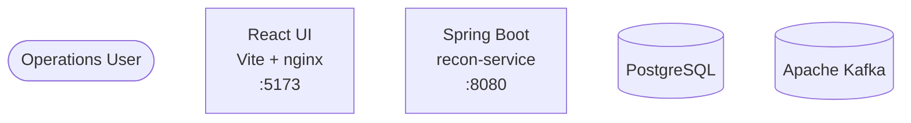
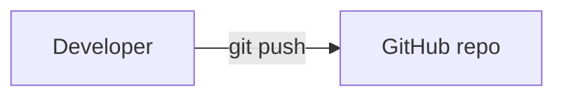
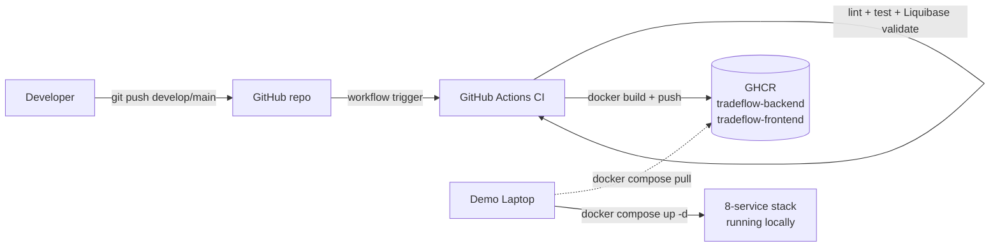

# Day 10 — Ship It: Docker, CI/CD & Final Demo

> **Theme:** Wrap the platform into a deployable, reproducible artifact.
> **Tickets:** **I125 – I140** (16 tickets)
> **Modules:** Docker Essentials + CI/CD with GitHub Actions

By the end of today you will:

- Have **backend + frontend + Postgres + Kafka + Prometheus + Grafana** all
  running on your laptop with a single `docker compose up -d`.
- Have a **GitHub Actions CI/CD pipeline** that builds, tests, validates the
  Liquibase migration, and **pushes Docker images to GitHub Container
  Registry (GHCR)** on every push to `develop` / `main`.
- Have a **15-minute live demo** rehearsed twice.
- Have tagged `v1.0.0` on `main` — your team's done.

---

## How today works

This day is **different from Days 1-9**. So far you've been writing application
code. Today you stop writing app code and start wiring **the platform around
it** — containers, orchestration, monitoring config, CI workflows, deploy
runbooks. The skill being practised is **operational engineering**, not Java.

> **Progressive hints — how to use them.** Every step ships with a 3-tier
> `Hints — progressive (open only what you need):` block plus a
> `Reference Solution` block (each collapsed by default -- click to expand).
> The convention for this day only:
>
> 1. **Try the step first** from the "What to do" + acceptance criteria.
> 2. If stuck, open Hint 1 (basic nudge). Try again. Then Hint 2, then Hint 3.
> 3. The **Reference Solution** is the complete, copy-paste-ready answer.
>    Read every line, **explain it back to your pair** before copying.
>
> Ops engineering is about *understanding the wiring*, not *re-deriving
> Docker syntax from scratch*. The Reference Solution is a teaching tool,
> not an answer key -- instructors will ask you to explain choices
> line-by-line during the demo.

The day is split into **5 sprints**. Read the sprint intro before starting it,
work the steps inside it in order, and check in with the instructor between
sprints.

| Sprint | Time | Focus | Tickets |
|--------|------|-------|---------|
| 1 | 09:00 – 11:30 | Containerize the apps | I125, I126 |
| 2 | 11:30 – 13:30 | Wire the full stack | I127, I128, I129, I130, I131 |
| 3 | 14:00 – 15:00 | End-to-end smoke | I132 |
| 4 | 15:00 – 16:30 | CI/CD pipeline + GHCR | I133, I134, I135 |
| 5 | 16:30 – 17:30 | Documentation + demo prep | I136, I137, I138, I139, I140 |

If you're behind, **don't skip the demo rehearsal** (Sprint 5) — it's the only
deliverable the instructors directly grade.

---

## Deep-dive tutorials you'll reference today

These are the long-form walkthroughs. Open them in another tab and refer to
them inside the relevant sprint:

- [day10-local-cicd.md](./day10-local-cicd.md) — full CI → GHCR → laptop deploy walkthrough (Sprint 4).
- [day06-prometheus-grafana.md](../day6/day06-prometheus-grafana.md) — Prom + Grafana hands-on (most of Sprint 2's monitoring config was covered here on Day 6).
- [day02-liquibase.md](../day2/day02-liquibase.md) — Liquibase in Spring Boot (relevant for Sprint 2 Step 7).

---

# Sprint 1 — Containerize the apps (09:00 – 11:30)

## Why this matters

Right now your backend runs via `./mvnw spring-boot:run` and your frontend via
`npm run dev`. That's fine for development on *your* laptop. It is **not** how
you deliver software:

- A teammate cloning the repo on a different OS gets a different Java patch
  version, a different Node patch version, a different lockfile resolution.
- A CI server has to install JDK, Maven, Node, npm, system libs — every run.
- Deployment ("just run `./mvnw spring-boot:run`") leaks your build environment
  into your deploy environment.

The fix is **containers**. A `Dockerfile` describes "the exact filesystem +
runtime my app needs", and `docker build` freezes that into an **image** — a
single artifact you can ship, version-tag, and run identically anywhere
Docker runs.

Today you write the Dockerfile for the backend, then the frontend. By
11:30 both your apps will be runnable as `docker run`.

---

## Step 1 — Backend Dockerfile (TICKET-I125)

**What**
- A two-stage `backend/Dockerfile` that builds the JAR in a Maven image and ships it on a slim JRE.

**Why**
- Day 5's app finally runs containerised so the demo (and CI) stops depending on whichever Java patch version happens to be on the laptop.
- Multi-stage keeps Maven and the JDK out of the final image, so the artifact CI later pushes to GHCR is ~180 MB, not ~600 MB.

**Observe**
- `docker images tradeflow-backend:dev` shows a size under 250 MB.
- `docker history tradeflow-backend:dev` shows no Maven layers in the final stage.

### Why a *multi-stage* build?

A naive Dockerfile copies your source code + Maven + JDK + the whole `~/.m2`
cache into the final image — easily 600 MB+. You don't need any of that at
runtime; you just need the compiled JAR + a JRE.

A **multi-stage** build splits the Dockerfile into two stages:

1. **Build stage**: a fat image (`maven:3.9-eclipse-temurin-17`) that knows
   how to compile your code.
2. **Runtime stage**: a lean image (`eclipse-temurin:17-jre-alpine`) that only
   knows how to *run* the JAR.

Only the final stage ships. Result: a ~180 MB image instead of 600 MB+, with
no Maven, no source code, no build tooling at runtime.

### What to do

> **File to create:** `backend/Dockerfile`

Write a two-stage Dockerfile that:

1. Uses `maven:3.9-eclipse-temurin-17` as the build stage, copies `pom.xml` first,
   runs `mvn dependency:go-offline`, then copies the source and runs `mvn package`.
2. Uses `eclipse-temurin:17-jre-alpine` as the runtime stage, copies the JAR
   from the build stage, exposes port 8080, sets `ENTRYPOINT ["java","-jar","/app/app.jar"]`.

### Acceptance criteria (TICKET-I125)

- [ ] Stage 1: `maven:3.9-eclipse-temurin-17` builds the JAR.
- [ ] Stage 2: `eclipse-temurin:17-jre-alpine` runs it.
- [ ] Final image < 250 MB.
- [ ] `EXPOSE 8080`, `ENTRYPOINT ["java","-jar","/app/app.jar"]`.

**Hints — progressive (open only what you need):**

<details>
<summary>Hint 1 — Basic nudge</summary>

Multi-stage = two `FROM` lines in one Dockerfile. The first stage has Maven + JDK to compile; the second has just a JRE to run. Only the final stage ships, so build tools never reach production. The point is to keep the runtime image small and free of compile-time junk.
</details>

<details>
<summary>Hint 2 — More guided</summary>

1. Stage 1 base: `maven:3.9-eclipse-temurin-17 AS build`. Set `WORKDIR /workspace`.
2. Copy `pom.xml` FIRST, run `mvn -B dependency:go-offline` — this layer caches so a one-line code change doesn't re-download Maven Central.
3. Then copy `src/` and run `mvn -B clean package -DskipTests`.
4. Stage 2 base: `eclipse-temurin:17-jre-alpine`. Set `WORKDIR /app`.
5. `COPY --from=build /workspace/target/*.jar /app/app.jar`. `EXPOSE 8080`. `ENTRYPOINT ["java","-jar","/app/app.jar"]`.
</details>

<details>
<summary>Hint 3 — Dockerfile skeleton</summary>

```dockerfile
# Stage 1: build the JAR
FROM maven:3.9-eclipse-temurin-17 AS build
WORKDIR /workspace
# TODO: cache deps — copy pom.xml then dependency:go-offline BEFORE copying src
# TODO: copy src and run mvn -B clean package -DskipTests

# Stage 2: lean runtime
FROM eclipse-temurin:17-jre-alpine
WORKDIR /app
# TODO: COPY --from=build the JAR to /app/app.jar
# TODO: EXPOSE 8080
# TODO: ENTRYPOINT java -jar /app/app.jar
```
</details>

<details>
<summary>Reference Solution — complete, copy-paste ready</summary>

**File to edit:** `backend/Dockerfile`

```dockerfile
# ============================================================================
# backend/Dockerfile — TICKET-I125
# Multi-stage: Maven builder -> JRE runtime. Final image ~180 MB.
# ============================================================================

# ---- Stage 1: build -------------------------------------------------------
FROM maven:3.9-eclipse-temurin-17 AS build
WORKDIR /workspace

# Copy pom.xml FIRST so the dependency layer caches independently of source.
COPY pom.xml ./
RUN mvn -B -e dependency:go-offline

# Now copy source and build the JAR.
COPY src ./src
RUN mvn -B -e clean package -DskipTests

# ---- Stage 2: lean runtime ------------------------------------------------
FROM eclipse-temurin:17-jre-alpine
WORKDIR /app

# Non-root user for security
RUN addgroup -S app && adduser -S app -G app

# wget is needed by HEALTHCHECK (alpine ships without curl by default).
RUN apk add --no-cache wget

USER app

COPY --from=build /workspace/target/*.jar /app/app.jar

EXPOSE 8080

# Liveness probe — `docker ps` shows `(healthy)` once /actuator/health returns 200.
HEALTHCHECK --interval=30s --timeout=5s --start-period=40s --retries=3 \
  CMD wget -qO- http://localhost:8080/actuator/health | grep -q '"status":"UP"' || exit 1

# -XX:+UseContainerSupport lets the JVM read cgroup limits so heap sizing
# honours the container's memory cap (default on JDK 17 but explicit is safer).
ENTRYPOINT ["java", "-XX:+UseContainerSupport", "-jar", "/app/app.jar"]
```
</details>

### How to verify

> **Terminal** — run from project root (`tradeflow-studentscopy/`)

```bash
# Build
docker build -t tradeflow-backend:dev backend/

# Confirm the image size — should be under 250 MB
docker images tradeflow-backend:dev

# Run it (Postgres won't be there yet, so expect startup errors — that's OK)
docker run --rm -p 8080:8080 tradeflow-backend:dev
```

### What to observe

- The first `docker build` is **slow** (~3-5 min) — Maven downloads everything.
- The second `docker build` (with no code changes) is **fast** (~10 sec) —
  Docker reuses the cached `~/.m2` layer.
- Change a single Java file, rebuild: only the source-copy + `mvn package`
  steps re-run. The dependency layer stays cached.

That layer-caching speedup is exactly why we copy `pom.xml` *before* the source.

### Common mistakes

| Symptom | Cause | Fix |
|---|---|---|
| Image is 800+ MB | You're using a single-stage build, or you forgot `-jre-alpine` and shipped the full JDK. | Confirm two `FROM` lines; runtime stage uses `*-jre-alpine`. |
| Every build re-downloads Maven deps | You copied `src/` before `pom.xml`. | Copy `pom.xml` first, run `mvn dependency:go-offline`, *then* copy `src/`. |
| `Exec format error` when running the image | You built on ARM (M1/M2/M3 Mac) and tried to run on x86 CI, or vice versa. | Add `--platform=linux/amd64` to `docker build` if your CI is x86. |
| Container starts then immediately exits | `Connection refused` to Postgres. **Expected** at this step — there's no DB yet. | Move on to Sprint 2; this gets wired then. |

---

## Step 2 — Frontend Dockerfile (TICKET-I126)

**What**
- A two-stage `frontend/Dockerfile` plus an `nginx.conf` that builds the SPA with Node and serves it with nginx, including the `/api/` reverse-proxy used in Day 7's UI.

**Why**
- Day 7's React app ships as a static bundle on demo day instead of `npm run dev` on someone's laptop, so the URL the audience sees never depends on a Vite dev server.
- The custom `nginx.conf` fixes the "refresh on `/trades` 404s" trap that catches every SPA the first time it leaves the dev server.

**Observe**
- `docker images tradeflow-frontend:dev` shows a size around 25 MB.
- `http://localhost:5173/trades` survives a hard refresh (no 404) once the container is up.

### Why a different shape?

The frontend is a **static asset** at runtime, not a long-running JVM. So:

- Build stage uses **Node** (to run `npm run build` and produce `dist/`).
- Runtime stage uses **nginx** (a static-file server). No Node in the final
  image.

This is the same multi-stage idea, but the runtime stage is much smaller —
nginx-alpine is ~25 MB.

You also need a custom `nginx.conf` because React is a SPA: refreshing the
`/trades` URL must serve `index.html`, not 404.

### What to do

> **File to create:** `frontend/Dockerfile`

Two-stage build:
1. `node:20-alpine` → `npm ci && npm run build` → `dist/`.
2. `nginx:1.27-alpine` → copy `dist/` to `/usr/share/nginx/html/`, copy custom
   `nginx.conf`, `EXPOSE 80`.

> **File to create:** `frontend/nginx.conf`

`try_files $uri $uri/ /index.html;` so SPA routes work on refresh. (Day 10's
local-CI/CD tutorial §7.4 has the full config including the `/api/` reverse
proxy.)

### Acceptance criteria (TICKET-I126)

- [ ] Stage 1: `node:20-alpine` runs `npm ci && npm run build`.
- [ ] Stage 2: `nginx:1.27-alpine` serves the `dist/` folder.
- [ ] Custom `nginx.conf` does fallback to `index.html` (SPA routing).
- [ ] `EXPOSE 80`.

**Hints — progressive (open only what you need):**

<details>
<summary>Hint 1 — Basic nudge</summary>

Same multi-stage idea as backend, different runtimes. Build stage = Node (runs `npm run build` to produce `dist/`). Runtime stage = nginx (static-file server, ~25 MB). React is a SPA so nginx needs a custom config that falls back to `index.html` for unknown paths — otherwise refreshing `/trades` 404s.
</details>

<details>
<summary>Hint 2 — More guided</summary>

1. Stage 1: `node:20-alpine AS build`. Copy `package*.json`, `npm ci`, then copy the rest and `npm run build`.
2. Stage 2: `nginx:1.27-alpine`. Replace nginx's default site with your `nginx.conf`. Copy `/dist` from the build stage into `/usr/share/nginx/html`. `EXPOSE 80`.
3. `nginx.conf` needs three things: `try_files $uri $uri/ /index.html;` for SPA fallback, `proxy_pass http://backend:8080;` for `/api/`, and the same for `/actuator/`.
</details>

<details>
<summary>Hint 3 — Dockerfile + nginx skeleton</summary>

```dockerfile
# Stage 1: build the SPA
FROM node:20-alpine AS build
WORKDIR /app
COPY package*.json ./
RUN npm ci
# TODO: copy source and run npm run build

# Stage 2: nginx serves /dist
FROM nginx:1.27-alpine
# TODO: COPY nginx.conf to /etc/nginx/conf.d/default.conf
# TODO: COPY --from=build /app/dist to /usr/share/nginx/html
EXPOSE 80
```

```nginx
server {
    listen 80;
    root /usr/share/nginx/html;
    index index.html;
    location / { try_files $uri $uri/ /index.html; }
    # TODO: proxy_pass /api/  -> http://backend:8080
    # TODO: proxy_pass /actuator/ -> http://backend:8080
}
```
</details>

<details>
<summary>Reference Solution — complete, copy-paste ready</summary>

**Files to edit:** `frontend/Dockerfile` and `frontend/nginx.conf`

```dockerfile
# ============================================================================
# frontend/Dockerfile — TICKET-I126
# Multi-stage: Node builder -> nginx runtime. Final image ~25 MB.
# ============================================================================

# ---- Stage 1: build -------------------------------------------------------
FROM node:20-alpine AS build
WORKDIR /app

COPY package*.json ./
RUN npm ci

COPY . .
RUN npm run build

# ---- Stage 2: nginx serve -------------------------------------------------
FROM nginx:1.27-alpine

COPY nginx.conf /etc/nginx/conf.d/default.conf
COPY --from=build /app/dist /usr/share/nginx/html

EXPOSE 80
```

```nginx
# frontend/nginx.conf — TICKET-I126
server {
    listen 80;
    server_name _;

    root /usr/share/nginx/html;
    index index.html;

    # gzip shaves first-paint time on the CSS/JS bundles.
    gzip on;
    gzip_types text/css application/javascript application/json;
    gzip_min_length 1024;

    # SPA fallback — refreshing /trades must serve index.html, not 404.
    location / {
        try_files $uri $uri/ /index.html;
    }

    # Reverse-proxy /api/ to the backend (Docker DNS resolves "backend").
    location /api/ {
        proxy_pass http://backend:8080;
        proxy_set_header Host              $host;
        proxy_set_header X-Real-IP         $remote_addr;
        proxy_set_header X-Forwarded-For   $proxy_add_x_forwarded_for;
        proxy_set_header X-Forwarded-Proto $scheme;
    }

    # Same for /actuator/ so health probes + Prometheus scrape work via nginx.
    location /actuator/ {
        proxy_pass http://backend:8080;
        proxy_set_header Host              $host;
        proxy_set_header X-Real-IP         $remote_addr;
        proxy_set_header X-Forwarded-For   $proxy_add_x_forwarded_for;
    }
}
```
</details>

### How to verify

> **Terminal** — run from project root (`tradeflow-studentscopy/`)

```bash
docker build -t tradeflow-frontend:dev frontend/
docker run --rm -p 5173:80 tradeflow-frontend:dev
# Open http://localhost:5173 — should see the React app.
# Navigate to /trades → refresh → should still see the app, not 404.
```

### What to observe

- Refreshing `/trades` works only if `nginx.conf` has `try_files`. Without
  it, you get nginx's default 404 page.
- API calls fail right now (no backend running) — that's expected.

### Common mistakes

| Symptom | Cause | Fix |
|---|---|---|
| `npm ci` fails with "lock file out of sync" | You ran `npm install` locally and forgot to commit `package-lock.json`. | `npm install`, commit the updated lockfile. |
| Refreshing `/trades` 404s | Missing `try_files` in `nginx.conf`. | Add `try_files $uri $uri/ /index.html;` inside the `location /` block. |
| API calls fail with CORS even on the same origin | Forgot to add the `/api/` `proxy_pass` block. | See [day10-local-cicd.md §7.4](./day10-local-cicd.md). |

---

## Run and Observe — End of Sprint 1 (Dockerise)

You've shipped 2 tickets (I125–I126) and both apps now build into images.
Before wiring them together in Sprint 2, prove each container boots
standalone.

**Run:**

> **Terminal** — from project root (`tradeflow-studentscopy/`)

```bash
# Build both images
docker build -t tradeflow-backend:dev ./backend
docker build -t tradeflow-frontend:dev ./frontend

# Smoke-boot the frontend image on its own (no backend yet)
docker run --rm -d -p 5173:80 --name tf-fe tradeflow-frontend:dev
docker ps                              # confirm tf-fe is Up
```

**Observe — sprint-specific:**

| Check | Expected after Sprint 1 |
|---|---|
| `docker images \| grep tradeflow` | Two rows: `tradeflow-backend:dev`, `tradeflow-frontend:dev`, both built in the last few minutes |
| `docker history tradeflow-backend:dev` | Multi-stage build — `eclipse-temurin:21-jre`-style runtime layer, no Maven layers leaked into final image |
| <http://localhost:5173> | Static React shell loads (API calls will 404 — backend isn't wired yet, that's expected) |
| `docker run --rm tradeflow-backend:dev java -version` | OpenJDK 21 reported, image is runnable |

Then tear the smoke container down so Sprint 2's `docker compose up` owns
port 5173: `docker rm -f tf-fe`.

**If something looks wrong:** `docker build` output is the source of truth
— re-read the failing layer, or check each step's verification section
above (Step 1 hints for backend, Step 2 hints for frontend).

---

# Sprint 2 — Wire the full stack (11:30 – 13:30)

## Why this matters

Two containers don't make a platform. You need them to talk to each other,
to Postgres, to Kafka, to Prometheus. The orchestration tool is
**`docker-compose`** — a single YAML file that describes every service, how
they connect, and what order they start in.

By the end of this sprint, `docker compose up -d` should bring 7 services to
"healthy", with no manual steps.

---

## Step 3 — `docker-compose.yml` — all 7 services (TICKET-I127)

**What**
- A single `docker-compose.yml` that brings up postgres, zookeeper, kafka, kafdrop, backend, frontend, prometheus and grafana with one `docker compose up -d`.

**Why**
- Everything from Day 2's Liquibase to Day 9's Kafka topology now lives behind one command, so the deploy story stops being "follow these 12 instructions in order".
- `image: ${BACKEND_IMAGE:-ghcr.io/...}` is what lets I133's CI pipeline ship images that the demo laptop later `docker compose pull`s — without this env-var override the laptop would always have to rebuild locally.

**Observe**
- `docker compose ps` shows every row as `Up` or `Up (healthy)` within ~60 seconds of a cold start.
- `docker compose exec backend nslookup postgres` resolves to a private IP on the compose network.

### Why one file for everything?

Imagine onboarding a new teammate. Option A: send them 12 commands across 7
different installs. Option B: send them this repo and `docker compose up -d`.
Compose is option B.

Beyond onboarding, compose gives you **a network** (every service can resolve
the others by name), **healthchecks** (services only start once their deps
are ready), and **named volumes** (data survives restarts).

### What to do

Open `docker-compose.yml`. You'll find skeleton sections (mostly commented
out) for each of the 7 services. Uncomment + fill in each one.

> **File to edit:** `docker-compose.yml`

Services to wire (in this order, top-to-bottom in the file):

1. **`postgres`** — already partly there. Confirm the healthcheck.
2. **`zookeeper`** — `confluentinc/cp-zookeeper:7.5.0`, port 2181.
3. **`kafka`** — `confluentinc/cp-kafka:7.5.0`, depends on zookeeper. Two
   listeners: `kafka:29092` for internal, `localhost:9092` for host.
4. **`kafdrop`** — `obsidiandynamics/kafdrop:latest`, port 9000. The Kafka UI.
5. **`backend`** — `image: ${BACKEND_IMAGE:-ghcr.io/<org>/tradeflow-backend:latest}`,
   depends on postgres + kafka, env vars for `SPRING_DATASOURCE_URL` and
   `SPRING_KAFKA_BOOTSTRAP_SERVERS`. **Use service names, not localhost.**
6. **`frontend`** — `image: ${FRONTEND_IMAGE:-ghcr.io/<org>/tradeflow-frontend:latest}`,
   depends on backend, port 5173:80.
7. **`prometheus`** — `prom/prometheus:latest`, port 9090, mount
   `./monitoring/prometheus/prometheus.yml`.
8. **`grafana`** — `grafana/grafana:latest`, port 3000, mount
   `./monitoring/grafana/provisioning`, depends on prometheus.

> Yes, that's 8 services if you include Kafdrop. The "7 services" headline
> count usually drops Kafdrop because it's a Kafka *UI*, not a Kafka peer.
> Wire it anyway — you'll need it for the smoke test.

### Acceptance criteria (TICKET-I127)

- [ ] Services: `postgres, zookeeper, kafka, kafdrop, backend, frontend, prometheus, grafana`.
- [ ] `depends_on` with healthchecks where applicable.
- [ ] Single `docker compose up` brings the whole platform to "healthy".
- [ ] **Backend + frontend services use `image:` (not `build:`)**, pointing at
      GHCR with an env-var override:
      `image: ${BACKEND_IMAGE:-ghcr.io/<org>/tradeflow-backend:latest}`. This
      lets the demo laptop pull CI-tested images instead of rebuilding locally.
      See [day10-local-cicd.md §3](./day10-local-cicd.md).
- [ ] Kafka, Postgres, Prometheus, Grafana use upstream Docker Hub images
      (no CI build needed for those).

**Hints — progressive (open only what you need):**

<details>
<summary>Hint 1 — Basic nudge</summary>

A compose file declares each service (image, ports, env, depends_on) under a single `services:` map. Bringing up the stack = `docker compose up -d`. Two big rules: service-to-service URLs use the **service name**, not `localhost`; and `depends_on:` with `condition: service_healthy` is what stops the backend from booting before Postgres is ready.
</details>

<details>
<summary>Hint 2 — More guided</summary>

1. Order matters in readability, not in startup — `depends_on:` controls startup.
2. Postgres: `postgres:15-alpine`, healthcheck on `pg_isready`, named volume `postgres-data`.
3. Zookeeper: `confluentinc/cp-zookeeper:7.5.0`, env `ZOOKEEPER_CLIENT_PORT: 2181`.
4. Kafka: `confluentinc/cp-kafka:7.5.0`, **two listeners** declared — `PLAINTEXT://kafka:29092` (internal) and `PLAINTEXT_HOST://localhost:9092` (host).
5. Backend: `image: ${BACKEND_IMAGE:-ghcr.io/<org>/tradeflow-backend:latest}`, env points at `postgres:5432` and `kafka:29092` (NOT localhost).
6. Frontend: same env-var pattern, `ports: ["5173:80"]`.
7. Prometheus + Grafana: mount `./monitoring/...` configs read-only.
</details>

<details>
<summary>Hint 3 — compose skeleton</summary>

```yaml
version: "3.9"
services:
  postgres:
    image: postgres:15-alpine
    # TODO: env vars, ports, named volume, healthcheck (pg_isready)

  zookeeper:
    image: confluentinc/cp-zookeeper:7.5.0
    # TODO: ZOOKEEPER_CLIENT_PORT, ZOOKEEPER_TICK_TIME

  kafka:
    image: confluentinc/cp-kafka:7.5.0
    depends_on: [zookeeper]
    # TODO: BOTH listeners (kafka:29092 internal + localhost:9092 host)

  kafdrop:
    image: obsidiandynamics/kafdrop:latest
    # TODO: KAFKA_BROKERCONNECT: kafka:29092, ports 9000

  backend:
    image: ${BACKEND_IMAGE:-ghcr.io/<org>/tradeflow-backend:latest}
    depends_on:
      postgres: { condition: service_healthy }
      kafka:    { condition: service_started }
    # TODO: SPRING_DATASOURCE_URL, SPRING_KAFKA_BOOTSTRAP_SERVERS (service names!)

  frontend:
    image: ${FRONTEND_IMAGE:-ghcr.io/<org>/tradeflow-frontend:latest}
    # TODO: depends_on backend, ports 5173:80

  prometheus:
    image: prom/prometheus:latest
    # TODO: mount ./monitoring/prometheus/prometheus.yml

  grafana:
    image: grafana/grafana:latest
    # TODO: mount ./monitoring/grafana/provisioning, depends on prometheus

volumes:
  postgres-data:
  grafana-data:
```
</details>

<details>
<summary>Reference Solution — complete, copy-paste ready</summary>

**File to edit:** `docker-compose.yml`

> Replace `your-org` in the two `image:` lines with your real GitHub org / user
> (or override at deploy time via `BACKEND_IMAGE` / `FRONTEND_IMAGE` in `.env`).

```yaml
# ============================================================================
# docker-compose.yml — TICKET-I127 (8 services, full stack)
# ============================================================================
version: "3.9"

services:

  postgres:
    image: postgres:15-alpine
    container_name: tradeflow-postgres
    environment:
      POSTGRES_DB: ${POSTGRES_DB:-tradeflow}
      POSTGRES_USER: ${POSTGRES_USER:-tradeflow_user}
      POSTGRES_PASSWORD: ${POSTGRES_PASSWORD:-changeme}
    ports: ["5432:5432"]
    volumes:
      - postgres-data:/var/lib/postgresql/data
    healthcheck:
      test: ["CMD-SHELL", "pg_isready -U ${POSTGRES_USER:-tradeflow_user}"]
      interval: 5s
      timeout: 5s
      retries: 10
    restart: unless-stopped

  zookeeper:
    image: confluentinc/cp-zookeeper:7.5.0
    container_name: tradeflow-zookeeper
    environment:
      ZOOKEEPER_CLIENT_PORT: 2181
      ZOOKEEPER_TICK_TIME: 2000
    restart: unless-stopped

  kafka:
    image: confluentinc/cp-kafka:7.5.0
    container_name: tradeflow-kafka
    depends_on: [zookeeper]
    ports: ["9092:9092"]
    environment:
      KAFKA_BROKER_ID: 1
      KAFKA_ZOOKEEPER_CONNECT: zookeeper:2181
      KAFKA_LISTENER_SECURITY_PROTOCOL_MAP: PLAINTEXT:PLAINTEXT,PLAINTEXT_HOST:PLAINTEXT
      KAFKA_ADVERTISED_LISTENERS: PLAINTEXT://kafka:29092,PLAINTEXT_HOST://localhost:9092
      KAFKA_LISTENERS: PLAINTEXT://0.0.0.0:29092,PLAINTEXT_HOST://0.0.0.0:9092
      KAFKA_INTER_BROKER_LISTENER_NAME: PLAINTEXT
      KAFKA_OFFSETS_TOPIC_REPLICATION_FACTOR: 1
      KAFKA_AUTO_CREATE_TOPICS_ENABLE: "true"
    healthcheck:
      test: ["CMD-SHELL", "kafka-broker-api-versions --bootstrap-server localhost:9092 >/dev/null 2>&1"]
      interval: 10s
      timeout: 5s
      retries: 10
    restart: unless-stopped

  kafdrop:
    image: obsidiandynamics/kafdrop:latest
    container_name: tradeflow-kafdrop
    depends_on:
      kafka: { condition: service_healthy }
    ports: ["9000:9000"]
    environment:
      KAFKA_BROKERCONNECT: kafka:29092
      JVM_OPTS: "-Xms32M -Xmx128M"
    restart: unless-stopped

  backend:
    image: ${BACKEND_IMAGE:-ghcr.io/your-org/tradeflow-backend:latest}
    container_name: tradeflow-backend
    depends_on:
      postgres: { condition: service_healthy }
      kafka:    { condition: service_healthy }
    ports: ["8080:8080"]
    environment:
      SPRING_PROFILES_ACTIVE: docker
      POSTGRES_HOST: postgres
      POSTGRES_PORT: "5432"
      POSTGRES_DB: ${POSTGRES_DB:-tradeflow}
      POSTGRES_USER: ${POSTGRES_USER:-tradeflow_user}
      POSTGRES_PASSWORD: ${POSTGRES_PASSWORD:-changeme}
      KAFKA_BOOTSTRAP_SERVERS: kafka:29092
    healthcheck:
      test: ["CMD-SHELL", "wget -qO- http://localhost:8080/actuator/health | grep -q '\"status\":\"UP\"' || exit 1"]
      interval: 15s
      timeout: 5s
      retries: 10
      start_period: 40s
    restart: unless-stopped

  frontend:
    image: ${FRONTEND_IMAGE:-ghcr.io/your-org/tradeflow-frontend:latest}
    container_name: tradeflow-frontend
    depends_on:
      backend: { condition: service_healthy }
    ports: ["5173:80"]
    healthcheck:
      test: ["CMD-SHELL", "wget -qO- http://localhost:80/ >/dev/null 2>&1 || exit 1"]
      interval: 15s
      timeout: 5s
      retries: 5
    restart: unless-stopped

  prometheus:
    image: prom/prometheus:latest
    container_name: tradeflow-prometheus
    depends_on:
      backend: { condition: service_healthy }
    ports: ["9090:9090"]
    volumes:
      - ./monitoring/prometheus/prometheus.yml:/etc/prometheus/prometheus.yml:ro
    command:
      - '--config.file=/etc/prometheus/prometheus.yml'
      - '--storage.tsdb.path=/prometheus'
      - '--web.enable-lifecycle'
    restart: unless-stopped

  grafana:
    image: grafana/grafana:latest
    container_name: tradeflow-grafana
    depends_on: [prometheus]
    ports: ["3000:3000"]
    environment:
      GF_SECURITY_ADMIN_USER: ${GRAFANA_USER:-admin}
      GF_SECURITY_ADMIN_PASSWORD: ${GRAFANA_PASSWORD:-admin}
      GF_USERS_ALLOW_SIGN_UP: "false"
    volumes:
      - ./monitoring/grafana/provisioning:/etc/grafana/provisioning:ro
      - grafana-data:/var/lib/grafana
    restart: unless-stopped

volumes:
  postgres-data:
  grafana-data:
```
</details>

### How to verify

> **Terminal** — run from project root (`tradeflow-studentscopy/`)

```bash
# First time — build local images for backend/frontend before GHCR is wired
docker compose build backend frontend

# Bring it all up
docker compose up -d

# Watch them come healthy
docker compose ps
```

### What to observe

- Services start in **dependency order**: postgres → kafka → backend → frontend.
- `docker compose ps` `STATUS` column is your map. `Up (healthy)` is the goal.
- `docker compose logs -f backend` shows Liquibase running migrations on first
  startup. (If it doesn't, see Step 7.)

### Common mistakes

| Symptom | Cause | Fix |
|---|---|---|
| Backend can't connect to Postgres | `SPRING_DATASOURCE_URL: jdbc:postgresql://localhost:5432/...` | Use the service name: `jdbc:postgresql://postgres:5432/...`. |
| Backend can't connect to Kafka | `SPRING_KAFKA_BOOTSTRAP_SERVERS: localhost:9092` | Inside the compose network it's `kafka:29092`. |
| Backend boots, then dies because Postgres isn't ready yet | `depends_on:` without `condition: service_healthy`. | Add `condition: service_healthy` under the postgres dep. |
| Kafka starts then immediately exits | `KAFKA_ADVERTISED_LISTENERS` only declares one listener. | Declare **both** internal (`kafka:29092`) and external (`localhost:9092`). |
| `docker compose up` rebuilds backend on every run | `build:` and `image:` both set. | Pick one. For Option A use `image:` only. |

---

## Step 4 — Docker networking (TICKET-I128)

**What**
- A documented network map at the top of `docker-compose.yml` plus an audit pass that replaces every `localhost` in service-to-service URLs with the right service name + container port.

**Why**
- Day 2's `localhost:5432` and Day 9's `localhost:9092` were correct on bare metal but become subtle bugs the second the apps share a compose network — this ticket is the conceptual one that prevents Sprint-3 smoke failures.

**Observe**
- `grep -RIn localhost docker-compose.yml frontend/nginx.conf monitoring/` returns only the legitimate Kafka host listener.
- `docker compose exec backend wget -qO- http://prometheus:9090/-/healthy` returns 200 OK.

### Why this is its own ticket

Step 3 mostly *uses* the compose network without explaining it. This ticket
is the conceptual one — make sure your team can answer "how does the backend
reach Postgres?" before moving on.

### What to do

Audit your `docker-compose.yml`. For every service-to-service connection:

1. Confirm the URL uses the service **name** (not `localhost`, not an IP).
2. Confirm the URL uses the **internal** port (the container's port), not the
   host port. (E.g. Kafka inside compose is `kafka:29092`, not `kafka:9092`.)

Document the network map in a comment block at the top of
`docker-compose.yml`.

### Acceptance criteria (TICKET-I128)

- [ ] Default compose network only; service-to-service uses container names.
- [ ] Backend uses `jdbc:postgresql://postgres:5432/tradeflow` (NOT localhost).
- [ ] Prometheus scrapes `backend:8080`.
- [ ] Frontend → Backend via `VITE_API_BASE_URL=http://backend:8080/api/v1` at
      BUILD time, OR via nginx reverse-proxy at RUNTIME.

**Hints — progressive (open only what you need):**

<details>
<summary>Hint 1 — Basic nudge</summary>

Compose auto-creates one bridge network and attaches every service to it. Inside that network, services find each other by service **name** as DNS, on the **internal** (container) port — never `localhost`, never the host-mapped port. Your audit job: every service-to-service URL should be `<service-name>:<container-port>`.
</details>

<details>
<summary>Hint 2 — More guided</summary>

Grep your own configs for `localhost` — any hit that's used by another container is a bug. The four URLs to audit:

1. Backend → Postgres: `jdbc:postgresql://postgres:5432/...` (NOT `localhost:5432`).
2. Backend → Kafka: `kafka:29092` (NOT `kafka:9092` — that's the host listener).
3. Prometheus → Backend: `backend:8080` (NOT `host.docker.internal:8080`).
4. Frontend nginx → Backend: `proxy_pass http://backend:8080;` (NOT `http://localhost:8080`).

Document the map as a comment block at the top of `docker-compose.yml`.
</details>

<details>
<summary>Hint 3 — Verification commands</summary>

```bash
# Confirm the network exists
docker network ls | grep _default

# Confirm DNS resolves inside the network
docker compose exec backend nslookup postgres
docker compose exec backend nslookup kafka

# Smoke a connection from inside the backend container
docker compose exec backend wget -qO- http://prometheus:9090/-/healthy

# Grep your own configs for localhost smells
grep -RIn localhost docker-compose.yml frontend/nginx.conf monitoring/
```
</details>

<details>
<summary>Reference Solution — complete, copy-paste ready</summary>

**File to edit:** `docker-compose.yml` (drop this comment block at the very top, before `version:`)

```yaml
# ============================================================================
# Network map (default compose bridge network):
#
#   browser  --[host:5173]-->  frontend (nginx)
#   browser  --[host:8080]-->  backend  (Spring Boot)
#
#   frontend --[/api/, /actuator/]-->  http://backend:8080      (proxy_pass)
#   backend  --[JDBC]              -->  jdbc:postgresql://postgres:5432/tradeflow
#   backend  --[Kafka client]      -->  kafka:29092             (INTERNAL listener)
#   prometheus --[/actuator/prometheus]--> http://backend:8080
#   grafana    --[datasource]      -->  http://prometheus:9090
#
# Inside the compose network, NEVER use `localhost`. localhost == the container
# itself. Use service names + container ports. Host-mapped ports (the left side
# of `5173:80`) are only for your browser / Postman on the laptop.
#
# Decision: we use the nginx reverse-proxy at RUNTIME (not VITE_API_BASE_URL
# at build time) so the same frontend image works in dev + demo without a rebuild.
# ============================================================================
```
</details>

### What to observe

- `docker network ls` shows a network named `<projectname>_default`. Every
  service is attached to it.
- `docker compose exec backend nslookup postgres` resolves to a private IP
  on that network. Same for `kafka`, `prometheus`, etc.

### Common mistakes

- "I'll just bind everything to `localhost` and use port mapping" — works for
  the **host → container** direction (browser → frontend) but breaks for
  **container → container** (backend → postgres).
- Mixing internal and host ports in URLs (e.g. backend trying `kafka:9092`
  instead of `kafka:29092`). Internal ports are what other containers see.

---

## Step 5 — `prometheus.yml` (TICKET-I129)

**What**
- A committed `monitoring/prometheus/prometheus.yml` with a `prometheus-self` job and a `recon-service` job pointed at `backend:8080/actuator/prometheus`.

**Why**
- Day 6's Prometheus lab used `host.docker.internal`; this ticket retargets the scrape at the compose-network service name so `recon-service` actually goes green when the whole stack is in Docker.

**Observe**
- `http://localhost:9090/targets` shows both jobs as **UP** (green).
- `curl -s http://localhost:9090/api/v1/targets | jq '.data.activeTargets[].labels.job'` returns `prometheus-self` and `recon-service`.

### Why mostly already done

You wired this in Day 6's hands-on lab. This ticket is the "make sure it's
committed and points at the right targets" check.

**See:** [day06-prometheus-grafana.md](../day6/day06-prometheus-grafana.md) for the full Prom config walkthrough.

### Acceptance criteria (TICKET-I129)

- [ ] Job `recon-service` scrapes `backend:8080/actuator/prometheus` every 15s.
- [ ] Job `prometheus-self`.
- [ ] Committed under `monitoring/prometheus/`.

**Hints — progressive (open only what you need):**

<details>
<summary>Hint 1 — Basic nudge</summary>

`prometheus.yml` lives in `monitoring/prometheus/` and is mounted into the prometheus container by compose. Two scrape jobs: itself (`prometheus-self`) and the Spring Boot Actuator endpoint (`recon-service`). The target host is the compose service name, not `localhost` or `host.docker.internal`.
</details>

<details>
<summary>Hint 2 — More guided</summary>

1. `global.scrape_interval: 15s` (Prom default is too slow for a workshop demo).
2. Job `prometheus-self` → `targets: ['localhost:9090']` (this one IS localhost — Prom scrapes its own /metrics from inside its own container).
3. Job `recon-service` → `metrics_path: '/actuator/prometheus'`, `targets: ['backend:8080']`.
4. Leave a commented-out `kafka` job at the bottom for when the JMX exporter is wired (TICKET-I121).
</details>

<details>
<summary>Hint 3 — Verification queries</summary>

```bash
# After docker compose up
curl http://localhost:9090/api/v1/targets | jq '.data.activeTargets[].labels.job'
# Expect: "prometheus-self", "recon-service"

# Check the target is UP
open http://localhost:9090/targets
# Both jobs should be green ('UP')
```
</details>

<details>
<summary>Reference Solution — complete, copy-paste ready</summary>

**File to edit:** `monitoring/prometheus/prometheus.yml`

```yaml
# ============================================================================
# monitoring/prometheus/prometheus.yml — TICKET-I129
# Scrapes the backend container's actuator endpoint every 15s.
# ============================================================================
global:
  scrape_interval: 15s
  evaluation_interval: 15s
  scrape_timeout: 10s

scrape_configs:

  # Self — Prom scrapes its own /metrics
  - job_name: 'prometheus-self'
    static_configs:
      - targets: ['localhost:9090']

  # Backend (Spring Boot Actuator)
  - job_name: 'recon-service'
    metrics_path: '/actuator/prometheus'
    static_configs:
      # Inside the compose network -- service name, not localhost.
      - targets: ['backend:8080']

  # Kafka JMX exporter (leave commented until TICKET-I121's JMX exporter is wired).
  # - job_name: 'kafka'
  #   static_configs:
  #     - targets: ['kafka:9101']
```
</details>

### What to observe

After `docker compose up`, open `http://localhost:9090/targets`. Both jobs
should be **UP** (green). If `recon-service` is DOWN with "connection
refused", you've still got `localhost:8080` somewhere instead of `backend:8080`.

---

## Step 6 — Grafana provisioning (TICKET-I130)

**What**
- A `monitoring/grafana/provisioning/` tree with a Prometheus datasource YAML and a dashboard-provider YAML, plus the Day-6 and Day-9 dashboard JSONs dropped alongside.

**Why**
- Day 6's dashboards were imported by clicking through the Grafana UI. Provisioning makes the cold-boot demo reproducible: `docker compose up -d` and the dashboards are already there, no manual import on stage.

**Observe**
- `http://localhost:3000` -> **Connections > Data sources** shows Prometheus pre-registered with no manual click.
- **Dashboards > TradeFlow** folder shows the API dashboard from Day 6 and the Kafka dashboard from Day 9 populated.

### Why mostly already done

Same as Step 5 — wired in Day 6's lab. This ticket is the audit.

**See:** [day06-prometheus-grafana.md §3 Step 4](../day6/day06-prometheus-grafana.md) for the provisioning walkthrough.

### Acceptance criteria (TICKET-I130)

- [ ] `monitoring/grafana/provisioning/datasources/prometheus.yml` auto-registers Prometheus.
- [ ] `monitoring/grafana/provisioning/dashboards/dashboard.yml` loads the JSON dashboards from `dashboards/`.
- [ ] On compose-up, Grafana shows the API dashboard without any manual import.

**Hints — progressive (open only what you need):**

<details>
<summary>Hint 1 — Basic nudge</summary>

Grafana auto-loads anything dropped into `/etc/grafana/provisioning/`. Two YAMLs do the work: one registers the Prometheus datasource, one tells Grafana to load every `*.json` in a dashboards folder. Both are mounted from `./monitoring/grafana/provisioning` by compose.
</details>

<details>
<summary>Hint 2 — More guided</summary>

1. `monitoring/grafana/provisioning/datasources/prometheus.yml` — `apiVersion: 1`, a single datasource entry pointing at `http://prometheus:9090` with `isDefault: true`.
2. `monitoring/grafana/provisioning/dashboards/dashboard.yml` — `apiVersion: 1`, a `providers:` entry with `type: file`, a `folder:` name (shows up in Grafana sidebar), and `options.path:` set to the container path where the JSONs live.
3. The dashboard JSONs themselves (`api.json`, `kafka.json`) come from building dashboards in the Grafana UI and clicking Export. Commit whatever Export produces.
</details>

<details>
<summary>Hint 3 — Provisioning YAML skeleton</summary>

```yaml
# datasources/prometheus.yml
apiVersion: 1
datasources:
  - name: Prometheus
    type: prometheus
    access: proxy
    # TODO: url -- service name, not localhost
    url: http://prometheus:9090
    isDefault: true
```

```yaml
# dashboards/dashboard.yml
apiVersion: 1
providers:
  - name: TradeFlow dashboards
    type: file
    folder: TradeFlow
    options:
      # TODO: path -- inside the Grafana container
      path: /etc/grafana/provisioning/dashboards
```
</details>

<details>
<summary>Reference Solution — complete, copy-paste ready</summary>

**Files to edit:** `monitoring/grafana/provisioning/datasources/prometheus.yml` and `monitoring/grafana/provisioning/dashboards/dashboard.yml`

```yaml
# monitoring/grafana/provisioning/datasources/prometheus.yml
# ============================================================================
# Grafana datasource provisioning -- TICKET-I130
# Auto-registers Prometheus as the default Grafana datasource on boot.
# ============================================================================
apiVersion: 1

datasources:
  - name: Prometheus
    type: prometheus
    access: proxy
    # Service name, not localhost -- Grafana + Prometheus share the compose network.
    url: http://prometheus:9090
    isDefault: true
    # editable: true lets you live-edit during the demo Q&A. Flip to false to lock.
    editable: true
```

```yaml
# monitoring/grafana/provisioning/dashboards/dashboard.yml
# ============================================================================
# Grafana dashboard provider -- TICKET-I130
# Tells Grafana to auto-load every *.json file in this folder as a dashboard.
# Drop api.json (Day 6) and kafka.json (Day 9) into this directory.
# ============================================================================
apiVersion: 1

providers:
  - name: TradeFlow dashboards
    type: file
    folder: TradeFlow
    disableDeletion: false
    updateIntervalSeconds: 30
    allowUiUpdates: true
    options:
      path: /etc/grafana/provisioning/dashboards
      foldersFromFilesStructure: false
```
</details>

### What to observe

`http://localhost:3000` → log in (`admin`/`admin`) → **Connections > Data sources**
shows Prometheus pre-registered. **Dashboards > TradeFlow** shows the API
panel from Day 6, plus the Kafka panel from Day 9 (I121).

### Common mistakes

- "Dashboard folder is empty after `docker compose up`" — usually a malformed
  JSON file kills the whole provider. Check `docker compose logs grafana | grep -i provision`.
- "Datasource URL is `http://localhost:9090` instead of `http://prometheus:9090`" —
  same localhost-vs-service-name issue, just in the Grafana yml this time.

---

## Step 7 — Liquibase runs at container startup (TICKET-I131)

**What**
- An audit (no source change) that proves a cold-boot of the backend container applies every Day-2 Liquibase changeset against the compose Postgres.

**Why**
- Day 2's Liquibase pipeline was verified against H2 / local Postgres. This is the "does it still apply from inside the container" sanity check — if a `classpath:` prefix or `defer-datasource-initialization` crept back in, Sprint 2 onwards collapses.

**Observe**
- `docker compose logs backend | grep "ran successfully" | wc -l` matches the changeset count in `db.changelog-master.xml`.
- `docker compose exec postgres psql -U tradeflow_user -d tradeflow -c "SELECT count(*) FROM databasechangelog;"` returns the same number.

### Why this is mostly free

You did the wiring on Day 2 (additional topic lab) and it's been working in
local dev ever since. In Docker it works **the same way** — Spring Boot's
auto-config runs Liquibase on startup whether the JVM is on your laptop or in
a container. There's nothing new to write; just confirm.

**See:** [day02-liquibase.md](../day2/day02-liquibase.md) for the Liquibase pipeline.

### Acceptance criteria (TICKET-I131)

- [ ] Backend container runs Liquibase on startup.
- [ ] Verify: fresh `docker compose down -v && docker compose up`; Liquibase
      migrations log appears in backend stdout.

**Hints — progressive (open only what you need):**

<details>
<summary>Hint 1 — Basic nudge</summary>

There is nothing new to code. Spring Boot's auto-config runs Liquibase on startup whether the JVM is on your laptop or inside a container. The whole ticket is "verify a fresh container actually applies the migrations". Wipe the Postgres volume, bring the stack up, grep the backend log.
</details>

<details>
<summary>Hint 2 — More guided</summary>

1. `docker compose down -v` -- the `-v` is what makes this a real test. It deletes the named `postgres-data` volume so Postgres starts empty.
2. `docker compose up -d`.
3. `docker compose logs backend | grep -i liquibase` -- expect `ChangeSet ... ran successfully` lines.
4. Sanity-check with psql: `docker compose exec postgres psql -U tradeflow_user -d tradeflow -c '\dt'` -- should list `trades`, `instruments`, `counterparties`, `settlements`, `recon_breaks`, `audit_log`, `DATABASECHANGELOG`, `DATABASECHANGELOGLOCK`.
</details>

<details>
<summary>Hint 3 — Verification commands</summary>

```bash
# Fresh DB
docker compose down -v
docker compose up -d

# Liquibase ran?
docker compose logs backend | grep -iE "liquibase|changeset" | head -20

# Tables exist?
docker compose exec postgres psql -U tradeflow_user -d tradeflow -c '\dt'

# How many changesets applied?
docker compose exec postgres psql -U tradeflow_user -d tradeflow \
  -c "SELECT COUNT(*) FROM databasechangelog;"
```
</details>

<details>
<summary>Reference — full walkthrough</summary>

Nothing to write -- you are verifying behaviour that already exists. The
working `application-docker.yml` already wires Liquibase via Spring Boot's
auto-config. Sanity-check that nothing has been broken since Day 2:

```bash
# 1. Wipe the Postgres volume (this is the critical step -- otherwise the
#    DB already has the schema from a previous run and you have not actually
#    tested startup migration).
docker compose down -v

# 2. Bring backend + its deps up.
docker compose up -d postgres
docker compose up -d backend

# 3. Tail the backend log and confirm Liquibase ran.
docker compose logs backend | grep -iE "liquibase|ChangeSet .* ran successfully"

# 4. Confirm the row count in the changelog matches your changeset count.
docker compose exec postgres psql -U tradeflow_user -d tradeflow \
  -c "SELECT id, author, filename FROM databasechangelog ORDER BY orderexecuted;"
```

Assertion: every changeset in `db/changelog/db.changelog-master.xml` appears
as a row in `databasechangelog`.

If you see boot failures, walk these Day-2 regressions first:

- `spring.liquibase.change-log` carrying a `classpath:` prefix again
  (FileNotFoundException at startup) -- remove the prefix.
- `defer-datasource-initialization: true` set anywhere -- remove it. Causes a
  circular bean dep in Docker the same way as on H2.
- Empty `data.sql` -- delete the file or populate it.

Step 3's `docker-compose.yml` already gates the backend service on Postgres
`condition: service_healthy` and adds its own `HEALTHCHECK` against
`/actuator/health`, so `docker compose ps` only shows `(healthy)` once
Liquibase has finished applying every changeset.
</details>

### How to verify

> **Terminal** — run from project root (`tradeflow-studentscopy/`)

```bash
docker compose down -v          # -v wipes volumes — Postgres is fresh
docker compose up -d
docker compose logs backend | grep -i liquibase
# Expect: "ChangeSet ... ran successfully" lines
```

### Common mistakes

All the Liquibase classics from Day 2 §6 apply equally inside Docker. The
big three:

- `classpath:` prefix on `change-log` → `FileNotFoundException` at startup.
- `defer-datasource-initialization: true` → circular bean dep, backend crashes.
- Empty `data.sql` → SQL initializer fails on the empty script.

If you see the bug, check Day 2's common-mistakes table first — it's
probably already documented there.

---

## Run and Observe — End of Sprint 2 (Compose + observability)

You've shipped 5 tickets (I127–I131): compose file, networking,
`prometheus.yml`, Grafana provisioning, Liquibase auto-runs in the
container. The whole stack should now come up with one command.

**Run:**

> **Terminal** — from project root (`tradeflow-studentscopy/`)

```bash
docker compose up -d --build
docker compose ps      # confirm all 7+ services Up (healthy)
```

**Observe — full stack:**

| URL / Check | What |
|---|---|
| <http://localhost:5173> | React UI loads |
| <http://localhost:8080/swagger-ui.html> | Swagger lists endpoints |
| <http://localhost:9090/targets> | Prometheus shows `recon-service` target UP (green) |
| <http://localhost:3000> | Grafana dashboards (`admin`/`admin`) — TradeFlow folder populated |
| <http://localhost:9000> | Kafdrop shows `trade-events` topic |

**Observe — sprint-specific:**

| Check | Expected after Sprint 2 |
|---|---|
| `docker compose ps` | 7+ services: `postgres`, `zookeeper`, `kafka`, `kafdrop`, `backend`, `frontend`, `prometheus`, `grafana` — all `Up` or `Up (healthy)` |
| `docker compose exec backend nslookup postgres` | Resolves to a private IP on `<projectname>_default` — service-name DNS works |
| `docker compose logs backend \| grep ChangeSet` | One `ChangeSet ... ran successfully` line per Liquibase changeset — schema landed inside the container |
| `docker compose exec postgres psql -U tradeflow_user -d tradeflow -c "SELECT count(*) FROM trades;"` | Seed rows present (count > 0) — Liquibase ran end-to-end at container startup |
| Grafana → TradeFlow folder | Both API and Kafka dashboards visible, datasource `Prometheus` provisioned with no manual clicks |

**If something looks wrong:** `docker compose logs <service>` is the
first stop (e.g. `docker compose logs backend | tail -50`). Most boot
failures match a row in Step 3's or Step 7's common-mistakes table.

---

# Sprint 3 — End-to-end smoke (14:00 – 15:00)

## Why this matters

Up to now you've verified pieces in isolation. Sprint 3 is the **integration
test**: post a trade → it produces a Kafka event → a consumer reconciles it
→ a row lands in `audit_log` → the request shows up in the Grafana
request-rate panel → the Prometheus metric increments.

If any one of those steps doesn't fire, the demo on Day 10 PM doesn't work.
Catch it now.

---

## Step 8 — Full-stack smoke test (TICKET-I132)

**What**
- A single end-to-end run that drives one trade through UI -> backend DB write -> Kafka event -> Grafana metric tick -> audit-log row, plus a 60-second screen recording of the same flow.

**Why**
- This is the single ticket the entire 10-day project is graded against — if it goes green here, the live demo on stage works; if it doesn't, every later ticket is wasted.
- The screen recording is the universal backup the Step 15 (I139) rehearsals lean on when Kafka misbehaves live.

**Observe**
- All five checks complete inside ~10 seconds of the POST: trade in Kafdrop, request-rate panel ticks in Grafana, fresh row in `audit_log`, recon log line in backend stdout.
- `docs/demo-backup.mov` (or equivalent) exists on the demo laptop and is at least 45 seconds long.

### What to do

> **Terminal** — run from project root (`tradeflow-studentscopy/`)

```bash
# Fresh start
docker compose down -v
docker compose up -d
docker compose ps
# Expect all 8 services 'Up' or 'Up (healthy)'
```

Then run through this end-to-end flow:

1. Open the React UI: `http://localhost:5173`.
2. Post a trade (use the "Add Trade" form, or POST via Postman).
3. Open Kafdrop: `http://localhost:9000` → topic `trade-events`.
   Find your trade event.
4. Open Grafana: `http://localhost:3000` → API dashboard → request-rate
   panel ticks up.
5. Open Postgres:
   ```bash
   docker compose exec postgres psql -U tradeflow_user -d tradeflow \
     -c "SELECT * FROM audit_log ORDER BY created_at DESC LIMIT 5;"
   ```
   You should see a fresh row for your trade.

All five = green. Capture a 60-second screen recording (QuickTime / OBS) for
the demo (TICKET-I138 references this recording as your "live demo backup").

**Hints — progressive (open only what you need):**

<details>
<summary>Hint 1 — Basic nudge</summary>

This is an end-to-end smoke. The same trade has to ripple through all five layers: UI -> backend DB write -> Kafka event -> Grafana metric tick -> audit-log row. If ANY one of those misfires the demo dies, so you want to catch it now -- not on stage.
</details>

<details>
<summary>Hint 2 — More guided</summary>

Drive the flow from one terminal (curl/Postman) instead of the UI so you can re-run it deterministically:

1. Fresh start: `docker compose down -v && docker compose up -d`. Wait for `docker compose ps` to show all `Up`/`Up (healthy)`.
2. POST a trade via curl.
3. Open Kafdrop -- topic `trade-events` should have one new message.
4. Open Grafana -- API dashboard, time range "Last 5 min", request-rate panel ticks.
5. psql into Postgres -- `audit_log` has a row whose `created_at` matches your POST.

Save the trade payload as a Postman collection so you can replay on demo day.
</details>

<details>
<summary>Hint 3 — Smoke-test script</summary>

```bash
# 0. Fresh stack
docker compose down -v && docker compose up -d
sleep 30 && docker compose ps

# 1. Post a trade
curl -s -X POST http://localhost:8080/api/v1/trades \
  -u trader:trader \
  -H 'Content-Type: application/json' \
  -d '{"tradeRef":"TRD-SMOKE-001","instrumentId":1,"counterpartyId":1,"quantity":100,"price":245.50,"tradeDate":"2026-06-12"}'

# 2. Kafka event landed?
# TODO: open http://localhost:9000 -> trade-events -> latest message

# 3. Audit log row exists?
docker compose exec postgres psql -U tradeflow_user -d tradeflow \
  -c "SELECT * FROM audit_log ORDER BY created_at DESC LIMIT 5;"

# 4. Metric incremented?
curl -s http://localhost:8080/actuator/prometheus | grep tradeflow_trades_created_total
```
</details>

<details>
<summary>Reference Solution — complete, copy-paste ready</summary>

**File to edit:** `scripts/smoke-test.sh`

> Confirm before running: seed data has `instrumentId: 1` / `counterpartyId: 1`,
> and the basic-auth user `trader:trader-pw` matches TICKET-I094's seeded users
> (adjust the `-u` flag if your team chose different credentials).

```bash
#!/usr/bin/env bash
# scripts/smoke-test.sh -- TICKET-I132 (run from project root)
set -euo pipefail

echo "==> 0. Fresh stack"
docker compose down -v
docker compose up -d
echo "    Waiting 45s for Postgres + Liquibase + Kafka..."
sleep 45
docker compose ps

echo "==> 1. POST a trade"
TRADE_REF="TRD-SMOKE-$(date +%s)"
curl -fsS -X POST http://localhost:8080/api/v1/trades \
  -u trader:trader-pw \
  -H 'Content-Type: application/json' \
  -d "{\"tradeRef\":\"${TRADE_REF}\",\"instrumentId\":1,\"counterpartyId\":1,\"quantity\":100,\"price\":245.50,\"tradeDate\":\"$(date -I)\"}"
echo

echo "==> 2. Kafka event produced?"
docker compose exec -T kafka kafka-console-consumer \
  --bootstrap-server kafka:29092 \
  --topic trade-events \
  --from-beginning \
  --max-messages 1 \
  --timeout-ms 10000 \
  | grep -q "${TRADE_REF}" \
  && echo "    OK: ${TRADE_REF} found on trade-events" \
  || { echo "    FAIL: ${TRADE_REF} not on trade-events"; exit 1; }

echo "==> 3. Audit row?"
docker compose exec -T postgres psql -U tradeflow_user -d tradeflow \
  -c "SELECT created_at, action, entity_type FROM audit_log ORDER BY created_at DESC LIMIT 3;"

echo "==> 4. Metric ticked?"
curl -s http://localhost:8080/actuator/prometheus \
  | grep -E 'tradeflow_trades_created_total|http_server_requests' | head -5

echo "==> 5. Grafana reachable?"
curl -fsS -o /dev/null -w "    grafana HTTP %{http_code}\n" http://localhost:3000/api/health

echo "==> All five greens. Now screen-record the manual Kafdrop + Grafana walkthrough."
```
</details>

### Acceptance criteria (TICKET-I132)

- [ ] All 7 services healthy.
- [ ] Open the React UI, post a trade, see the Kafka event in Kafdrop, see the
      metric increment in Grafana, see the audit-log row in Postgres.
- [ ] Capture a 60-second screen recording for the final demo.

### What to observe

- The audit log row appears within ~1 second of posting the trade.
- The Grafana panel's request count moves in real time (refresh the panel if
  it doesn't — Grafana's default refresh is "Off").
- The Kafka consumer log shows `Reconciled trade TRD-... — status OPEN/MATCHED`.

### Common mistakes

| Symptom | Cause | Fix |
|---|---|---|
| Trade event doesn't appear in Kafdrop | Producer isn't called from `TradeService.createTrade()`. | Re-check TICKET-I115. The producer must run *after* the DB insert, not in a separate code path. |
| Audit log row never appears | `AuditEventConsumer` is in the same consumer group as `ReconEventConsumer` (so only one of them sees each event). | They must be in **different** consumer groups (TICKET-I119). |
| Grafana panel stays flat | "Last 6 hours" time range + you've only run for 5 minutes. | Switch to "Last 15 minutes" and enable 5-second refresh. |

---

## Run and Observe — End of Sprint 3 (End-to-end smoke)

You've shipped 1 ticket (I132) but it's the most important one of the
day: a single integration test that proves the platform is wired
correctly end-to-end. If this passes, the Day 10 PM demo works.

**Run:**

> **Terminal** — from project root (`tradeflow-studentscopy/`)

```bash
docker compose up -d
docker compose ps     # confirm all 8 services Up (healthy)
```

**End-to-end smoke:**

```bash
curl -u trader:trader-pw -X POST http://localhost:8080/api/v1/trades \
  -H "Content-Type: application/json" \
  -d '{"tradeRef":"TRD-PROD-1","instrumentId":1,"counterpartyId":1,"quantity":100,"price":250,"tradeDate":"2026-03-15"}'
```

Watch:
- Kafdrop (<http://localhost:9000>) → `trade-events` topic: new message at the top
- Grafana (<http://localhost:3000>) → API dashboard → request-rate panel ticks up
- Postgres → `audit_log`: new row for the trade

**Observe — sprint-specific:**

| Check | Expected after Sprint 3 |
|---|---|
| `docker compose logs backend \| grep "Reconciled trade" \| tail -5` | One `Reconciled trade TRD-PROD-1 — status OPEN/MATCHED` line — recon consumer fired |
| `docker compose exec postgres psql -U tradeflow_user -d tradeflow -c "SELECT trade_ref FROM audit_log ORDER BY created_at DESC LIMIT 1;"` | Top row is `TRD-PROD-1` — audit consumer (different consumer group) also fired |
| Prometheus query `rate(tradeflow_trades_created_total[1m])` | Non-zero spike just after the `curl` — custom counter incremented |
| 60-sec screen recording exists | The TICKET-I132 backup video is captured and findable on the demo laptop — your insurance policy if Kafka has a bad day |

**If something looks wrong:** Step 8's common-mistakes table maps the
three classic failure modes (Kafdrop empty, audit row missing, Grafana
flat) to the exact ticket-level fix.

---

# Sprint 4 — CI/CD pipeline with GHCR (15:00 – 16:30)

## Why this matters

So far the "build" step has been you typing `docker build`. That's fine while
you iterate. For a real deploy story, every push to `develop` / `main` should
**automatically** build, test, and ship the resulting images to a registry,
so the demo laptop just `docker compose pull`s the latest tested version
instead of re-running your build.

This sprint adds that pipeline. **Most of the depth is in
[day10-local-cicd.md](./day10-local-cicd.md)** — that's the long walkthrough.
The tickets below are the deliverables; the tutorial is the how.

---

## Step 9 — `.github/workflows/ci.yml` with GHCR push (TICKET-I133)

**What**
- A `docker-build` job in `.github/workflows/ci.yml` that logs in to `ghcr.io`, builds backend + frontend images, and pushes them tagged with both `${{ github.sha }}` and `latest` on every push to `develop` / `main`.

**Why**
- I133's CI pipeline is what the cohort handoff guide tells the next cohort to clone — without GHCR push the Step 3 `image:` reference has no images to pull.
- It also makes "demo day" reproducible: the laptop's `docker compose pull` always grabs CI-tested images, never a half-finished local rebuild.

**Observe**
- `https://github.com/<org>/<repo>/pkgs/container/tradeflow-backend` lists at least one SHA tag and `latest`.
- The Actions run shows the `docker-build` job green and the "Build + push" step pushing two image refs to GHCR.

### Why GHCR (not Docker Hub)?

GitHub Container Registry is **scoped to your repo**, **free with GitHub**,
and the **default workflow token** can already push to it. No separate
signup, no Docker Hub credentials in secrets, no rate limits on private repos.
You're already on GitHub; use the registry that comes with it.

### What to do

**Walkthrough:** [day10-local-cicd.md §3 Step 2](./day10-local-cicd.md) has
the full YAML — read it before editing.

Open `.github/workflows/ci.yml`. The `docker-build` job at the bottom currently
*builds* images but doesn't push them. Extend it to:

- Add `permissions: packages: write` at the job level.
- Log in to `ghcr.io` using `secrets.GITHUB_TOKEN`.
- Use `docker/build-push-action@v5` with `push: true`.
- Tag each image with **both** `${{ github.sha }}` and `latest`.

Keep the existing `if:` guard so pushes only happen on `develop`/`main`.

### Acceptance criteria (TICKET-I133)

- [ ] Trigger: `push` to any branch, `pull_request` to `develop` and `main`.
- [ ] Jobs: `lint`, `backend-build-test`, `frontend-build-test`, `docker-build`.
- [ ] Caches Maven + npm dependencies.
- [ ] Uses `services: postgres` for integration tests.
- [ ] **`docker-build` job pushes images to GHCR** on pushes to `develop`/`main`
      (not on every feature-branch push). Tag each image with both
      `${{ github.sha }}` and `latest`. Uses `actions/setup-buildx-action`,
      `docker/login-action` with `secrets.GITHUB_TOKEN`, and
      `docker/build-push-action`.
- [ ] Workflow `permissions:` includes `packages: write` so the push works
      with the default workflow token (no PAT needed for CI).
- [ ] Verify by opening
      `https://github.com/<org>/<repo>/pkgs/container/tradeflow-backend`
      and `tradeflow-frontend` — both should list a SHA tag + `latest`.

**Hints — progressive (open only what you need):**

<details>
<summary>Hint 1 — Basic nudge</summary>

GHCR is `ghcr.io` -- GitHub's container registry, free with your repo. The `GITHUB_TOKEN` that every workflow gets automatically can push to it, *if* you opt in with `permissions: packages: write`. No PAT, no Docker Hub creds, no rate limits.
</details>

<details>
<summary>Hint 2 — More guided</summary>

Add to the existing `docker-build:` job in `ci.yml`:

1. `permissions: { contents: read, packages: write }` at the job level.
2. `if:` guard so push only happens on `develop`/`main` (not on every feature push).
3. `docker/setup-buildx-action@v3` step (enables buildx, needed for cache + multi-arch).
4. `docker/login-action@v3` -- `registry: ghcr.io`, `username: ${{ github.actor }}`, `password: ${{ secrets.GITHUB_TOKEN }}`.
5. `docker/build-push-action@v5` for each image -- `push: true`, two `tags:` (`${{ github.sha }}` AND `latest`), `cache-from: type=gha` + `cache-to: type=gha,mode=max`.
</details>

<details>
<summary>Hint 3 — Workflow YAML skeleton</summary>

```yaml
  docker-build:
    needs: [backend-build-test, frontend-build-test]
    if: github.event_name == 'push' && (github.ref == 'refs/heads/develop' || github.ref == 'refs/heads/main')
    runs-on: ubuntu-latest
    permissions:
      contents: read
      packages: write
    steps:
      - uses: actions/checkout@v4
      - uses: docker/setup-buildx-action@v3
      # TODO: docker/login-action -- registry ghcr.io, user github.actor, pass GITHUB_TOKEN

      # TODO: docker/build-push-action for backend
      #       context ./backend, push true, tags = <sha> + latest, cache type=gha
      # TODO: same for frontend, context ./frontend
```
</details>

<details>
<summary>Reference Solution — complete, copy-paste ready</summary>

**File to edit:** `.github/workflows/ci.yml` (replace the existing `docker-build:` job at the bottom)

```yaml
  docker-build:
    needs: [backend-build-test, frontend-build-test]
    if: github.event_name == 'push' && (github.ref == 'refs/heads/develop' || github.ref == 'refs/heads/main')
    runs-on: ubuntu-latest

    # GHCR push needs packages:write. The default workflow token (GITHUB_TOKEN)
    # is read-only without this opt-in.
    permissions:
      contents: read
      packages: write

    steps:
      - uses: actions/checkout@v4

      - name: Set up Docker Buildx
        uses: docker/setup-buildx-action@v3

      - name: Log in to GHCR
        uses: docker/login-action@v3
        with:
          registry: ghcr.io
          username: ${{ github.actor }}
          # Auto-injected workflow token -- no PAT needed in CI.
          password: ${{ secrets.GITHUB_TOKEN }}

      - name: Build + push backend image
        id: build-backend
        uses: docker/build-push-action@v5
        with:
          context: ./backend
          push: true
          provenance: false
          tags: |
            ghcr.io/${{ github.repository_owner }}/tradeflow-backend:${{ github.sha }}
            ghcr.io/${{ github.repository_owner }}/tradeflow-backend:latest
          # Free Docker layer cache between CI runs.
          cache-from: type=gha
          cache-to: type=gha,mode=max

      - name: Build + push frontend image
        id: build-frontend
        uses: docker/build-push-action@v5
        with:
          context: ./frontend
          push: true
          provenance: false
          tags: |
            ghcr.io/${{ github.repository_owner }}/tradeflow-frontend:${{ github.sha }}
            ghcr.io/${{ github.repository_owner }}/tradeflow-frontend:latest
          cache-from: type=gha
          cache-to: type=gha,mode=max

      - name: Summary — pushed image refs
        run: |
          {
            echo "### Pushed images"
            echo ""
            echo "- \`ghcr.io/${{ github.repository_owner }}/tradeflow-backend:${{ github.sha }}\`"
            echo "- \`ghcr.io/${{ github.repository_owner }}/tradeflow-backend:latest\`"
            echo "- \`ghcr.io/${{ github.repository_owner }}/tradeflow-frontend:${{ github.sha }}\`"
            echo "- \`ghcr.io/${{ github.repository_owner }}/tradeflow-frontend:latest\`"
          } >> "$GITHUB_STEP_SUMMARY"
```
</details>

### What to observe

After pushing, watch the Actions tab. The first push is slow (~5 min) because
the Docker layer cache is empty. Subsequent pushes are 2-3x faster.

Open the package URLs in your browser — both packages should appear. Click
one and you'll see the tag list growing every time you push.

### Common mistakes

| Symptom | Cause | Fix |
|---|---|---|
| `docker-build` job fails with `403 Forbidden` on push | Missing `permissions: packages: write`. | Add it at the job level. |
| Image tag is `:refs-heads-main` instead of a SHA | Used `github.ref` instead of `github.sha`. | Swap to `${{ github.sha }}`. |
| Builds the right images but doesn't actually push them | Missing `push: true` on `docker/build-push-action`. | Add it. |
| Push works but `:latest` keeps pointing at a stale build | `:latest` is in the tag list but the build matrix only updates the SHA tag. | Both tags must be in the same `tags:` block. |

---

## Step 10 — Liquibase validate in CI (TICKET-I134)

**What**
- A `Liquibase validate` step in the `backend-build-test` job that runs `mvn liquibase:validate` against the Postgres sidecar before the integration tests start.

**Why**
- Day 2's master changelog is the schema source of truth — catching a malformed XML at 30 seconds into CI is the difference between a quick re-push and a 5-minute integration-test failure right before the demo.

**Observe**
- A deliberate typo in a changeset fails CI at the `Liquibase validate` step within ~30 seconds (not at the integration-test step ~5 minutes later).
- The step log ends with `Liquibase command 'validate' was executed successfully` when the changelog is clean.

### Why we run it twice

Liquibase already validates at app startup (Day 2). Why again in CI? **Speed
of feedback.** App startup happens at the end of the integration-test phase
— which is 2-5 minutes in. `liquibase:validate` runs in ~5 seconds at the
start of the CI job, so a malformed XML hits you in 30 seconds, not 5
minutes.

### What to do

Add a step to the existing `backend-build-test` job in `ci.yml`:

```yaml
- name: Liquibase validate
  working-directory: backend
  run: ./mvnw -B liquibase:validate \
    -Dliquibase.url=jdbc:postgresql://localhost:5432/tradeflow_test \
    -Dliquibase.username=ci -Dliquibase.password=ci
```

(The Postgres `services:` block already gives you a DB at `localhost:5432`.)

### Acceptance criteria (TICKET-I134)

- [ ] CI runs `mvn liquibase:validate` (or the CLI equivalent) on every push.
- [ ] Pipeline fails if a changeset is malformed.

**Hints — progressive (open only what you need):**

<details>
<summary>Hint 1 — Basic nudge</summary>

Add one step to the `backend-build-test` job. It runs `mvn liquibase:validate` against the Postgres sidecar that the job already declares under `services:`. The point is to fail fast on malformed XML (5 seconds in) instead of waiting for the integration-test phase (5 minutes in).
</details>

<details>
<summary>Hint 2 — More guided</summary>

1. Find the `backend-build-test:` job in `ci.yml`. It already declares `services: postgres:` -- you do not need to add one.
2. From the runner's perspective the sidecar Postgres is at `localhost:5432` (NOT `postgres:5432` -- that's compose-network syntax). Use `localhost`.
3. The step goes AFTER `Build + run unit tests` and BEFORE `Upload coverage report`.
4. Pass `-Dliquibase.url`, `-Dliquibase.username`, `-Dliquibase.password`. The credentials match the `services.postgres.env` block (`ci`/`ci`).
</details>

<details>
<summary>Hint 3 — Workflow YAML skeleton</summary>

```yaml
      # In backend-build-test, after the build/test step:
      - name: Liquibase validate
        working-directory: backend
        run: >
          ./mvnw -B liquibase:validate
          -Dliquibase.url=jdbc:postgresql://localhost:5432/tradeflow_test
          -Dliquibase.username=ci
          -Dliquibase.password=ci
          # TODO: also point at the master changelog file with -Dliquibase.changeLogFile=...
```
</details>

<details>
<summary>Reference Solution — complete, copy-paste ready</summary>

**File to edit:** `.github/workflows/ci.yml` — insert these steps in the `backend-build-test` job, AFTER "Build + run unit tests" and BEFORE "Upload coverage report".

> The Postgres `services:` block is already wired into the job, so
> `localhost:5432` resolves to the sidecar container from the runner's
> perspective. Do not use `postgres:5432` — that is compose-network syntax
> and does not apply inside an Actions runner.

```yaml
      # TICKET-I134: fail fast on malformed Liquibase XML.
      # liquibase:status is informational (lists pending changesets) — useful
      # debugging on long changelogs. validate is the gate that fails the build.
      - name: Liquibase status (informational)
        working-directory: backend
        run: >
          ./mvnw -B liquibase:status
          -Dliquibase.url=jdbc:postgresql://localhost:5432/tradeflow_test
          -Dliquibase.username=ci
          -Dliquibase.password=ci
          -Dliquibase.changeLogFile=src/main/resources/db/changelog/db.changelog-master.xml

      - name: Liquibase validate
        working-directory: backend
        run: >
          ./mvnw -B liquibase:validate
          -Dliquibase.url=jdbc:postgresql://localhost:5432/tradeflow_test
          -Dliquibase.username=ci
          -Dliquibase.password=ci
          -Dliquibase.changeLogFile=src/main/resources/db/changelog/db.changelog-master.xml
```
</details>

### What to observe

Push a deliberately broken XML changeset (e.g. typo in a column name). CI
should fail at the `Liquibase validate` step, not at integration tests.
Push the fix; both steps go green.

### Common mistakes

- Running `liquibase:validate` against the **wrong DB URL**. The CI Postgres
  is at `localhost:5432` from the runner's perspective (it's a sidecar
  container). Don't use `postgres:5432`.

---

## Step 11 — Coverage threshold (TICKET-I135)

**What**
- A JaCoCo plugin in `backend/pom.xml` with a `<rule>` failing the build if line coverage on `com.dbtraining.tradeflow.service` drops below 70%.

**Why**
- Days 4 and 8 added the unit + integration tests; without an enforced floor a single skipped `@Test` quietly drags the codebase from "tested" to "decorative" over the next cohort's iterations.

**Observe**
- Push a `@Test` lowered to `assertTrue(true)` — CI fails red at the JaCoCo step.
- Restore the assertion — CI goes green and `backend/target/site/jacoco/index.html` shows ≥ 70% on the service package.

### Why a threshold and not a number

A coverage number on its own is vanity. A **threshold** is policy: "coverage
on `service.*` must stay above 70% or the build fails". That stops the team
from quietly drifting from "70% covered" to "30% covered" over six months.

### What to do

Add the JaCoCo plugin to `backend/pom.xml` with a `<rule>` enforcing line
coverage ≥ 70% on the `com.dbtraining.tradeflow.service` package. Upload the
HTML report as a build artifact (the existing `Upload coverage report` step
already does this).

### Acceptance criteria (TICKET-I135)

- [ ] JaCoCo plugin configured to fail the build if line coverage on
      `service.*` < 70%.
- [ ] CI surfaces the coverage report as a build artifact.

**Hints — progressive (open only what you need):**

<details>
<summary>Hint 1 — Basic nudge</summary>

Add the `jacoco-maven-plugin` to `backend/pom.xml`. It needs three executions: `prepare-agent` (instrument bytecode), `report` (HTML output), `check` (enforce a `<rule>` that fails the build if the `service.*` package drops below 70% line coverage). The existing `Upload coverage report` step in `ci.yml` already uploads `target/site/jacoco/`.
</details>

<details>
<summary>Hint 2 — More guided</summary>

1. Pick a stable plugin version: `0.8.11`.
2. `prepare-agent` execution -- default phase, no extras needed. Sets `argLine` so Surefire runs with the JaCoCo agent attached.
3. `report` execution -- bind to `verify` phase, generates HTML/XML.
4. `check` execution -- also `verify` phase, `<rule><element>PACKAGE</element>` with `<includes>` listing `com.dbtraining.tradeflow.service`, `<limits>` with `<counter>LINE</counter>`, `<value>COVEREDRATIO</value>`, `<minimum>0.70</minimum>`.
5. Run locally with `./mvnw clean verify`. If it fails, the report at `backend/target/site/jacoco/index.html` shows which class dragged you below 70%.
</details>

<details>
<summary>Hint 3 — pom.xml skeleton</summary>

```xml
<plugin>
    <groupId>org.jacoco</groupId>
    <artifactId>jacoco-maven-plugin</artifactId>
    <version>0.8.11</version>
    <executions>
        <execution>
            <id>prepare-agent</id>
            <goals><goal>prepare-agent</goal></goals>
        </execution>
        <execution>
            <id>report</id>
            <phase>verify</phase>
            <goals><goal>report</goal></goals>
        </execution>
        <execution>
            <id>check-coverage</id>
            <phase>verify</phase>
            <goals><goal>check</goal></goals>
            <configuration>
                <!-- TODO: <rules> block enforcing 70% LINE on service.* -->
            </configuration>
        </execution>
    </executions>
</plugin>
```
</details>

<details>
<summary>Reference Solution — complete, copy-paste ready</summary>

**File to edit:** `backend/pom.xml` — add inside `<build><plugins>...</plugins></build>`.

> Adjust the `<include>` package to your real service package if it differs
> (e.g. `com.tradeflow.service`). The existing `Upload coverage report` step
> in `ci.yml` already uploads `backend/target/site/jacoco/` — no CI change needed.

```xml
<plugin>
    <groupId>org.jacoco</groupId>
    <artifactId>jacoco-maven-plugin</artifactId>
    <version>0.8.11</version>
    <executions>
        <!-- 1. Instrument bytecode before tests run. -->
        <execution>
            <id>prepare-agent</id>
            <goals>
                <goal>prepare-agent</goal>
            </goals>
        </execution>

        <!-- 2. Generate the HTML report at the verify phase. -->
        <execution>
            <id>report</id>
            <phase>verify</phase>
            <goals>
                <goal>report</goal>
            </goals>
        </execution>

        <!-- 3. Enforce the 70% line + 60% branch threshold on the service package. -->
        <execution>
            <id>check-coverage</id>
            <phase>verify</phase>
            <goals>
                <goal>check</goal>
            </goals>
            <configuration>
                <rules>
                    <rule>
                        <element>PACKAGE</element>
                        <includes>
                            <include>com.dbtraining.tradeflow.service</include>
                        </includes>
                        <limits>
                            <limit>
                                <counter>LINE</counter>
                                <value>COVEREDRATIO</value>
                                <minimum>0.70</minimum>
                            </limit>
                            <limit>
                                <counter>BRANCH</counter>
                                <value>COVEREDRATIO</value>
                                <minimum>0.60</minimum>
                            </limit>
                        </limits>
                    </rule>
                </rules>
            </configuration>
        </execution>
    </executions>
</plugin>
```
</details>

### How to verify

Lower a `@Test` method's assertions to `assertTrue(true)` (effectively a
no-op test). Coverage will dip; CI should fail at the JaCoCo check step. Put
the assertion back; CI goes green.

### Common mistakes

- Setting the threshold to 90% on day one — every minor test removal breaks
  CI, the team disables the check, you're back to square one. **70% is a
  meaningful floor**, not an aspiration.
- Putting the rule on `**/*` instead of `service.*` — now your generated DTOs
  drag the average down and you're fighting framework coverage.

---

## Run and Observe — End of Sprint 4 (CI/CD + GHCR)

You've shipped 3 tickets (I133–I135): GitHub Actions CI with GHCR push,
Liquibase validate in CI, and a JaCoCo coverage threshold. The pipeline
should now build, test, and publish images on every push to `main` /
`develop`.

**Run:**

> **Terminal** — from project root (`tradeflow-studentscopy/`)

```bash
# Trigger CI by pushing a no-op commit (or just open the Actions tab on
# the existing push).
git commit --allow-empty -m "CI smoke after Sprint 4"
git push
```

Then open: `https://github.com/<your-org>/<repo>/actions` (latest run).

**Observe — sprint-specific:**

| Check | Expected after Sprint 4 |
|---|---|
| GitHub Actions → latest run | Green tick across all jobs: `build-test`, `liquibase-validate`, `docker-push` |
| Job log → "Liquibase validate" step | `Liquibase command 'validate' was executed successfully` — no drift between changelog and DB schema |
| Job log → JaCoCo step | `All coverage checks have been met` (≥ 70% on `service.*`) — falls below and the job fails red |
| `https://github.com/<your-org>?tab=packages` (or org Packages tab) | Two GHCR packages: `tradeflow-backend` and `tradeflow-frontend`, each tagged with the commit SHA and `latest` |
| `docker pull ghcr.io/<your-org>/tradeflow-backend:latest` (after `docker login ghcr.io`) | Image pulls cleanly — proves the demo laptop can fetch what CI built |

**Negative test — prove the coverage gate actually fires:** lower a
`@Test` assertion to `assertTrue(true)`, push, and watch CI fail red at
the JaCoCo step. Revert, push, watch it go green.

**If something looks wrong:** the Actions job log says what.
`pull access denied` on the GHCR step usually means missing
`permissions: packages: write` in `ci.yml` (Step 9's common-mistakes
table covers the rest).

---

# Sprint 5 — Documentation & demo prep (16:30 – 17:30)

## Why this matters

A working platform that nobody can run, can't be explained, and falls over
in the live demo… is not a working platform. This sprint ships the docs and
rehearses the demo until both are bulletproof.

---

## Step 12 — Architecture diagram (TICKET-I136)

**What**
- A `docs/architecture.md` with two Mermaid diagrams: a runtime component view (user -> React -> backend -> Postgres + Kafka -> consumers -> Prom -> Grafana) and a CI/CD + deploy flow (developer push -> Actions -> GHCR -> laptop).

**Why**
- The reviewer who opens the repo on Monday morning has 30 seconds; the component diagram is what tells them "this team built a real system" before they read a line of code.
- The CI/CD diagram makes Option A's deploy story visible at the architecture level, not just buried in the runbook.

**Observe**
- Both diagrams render inline when the file is viewed on GitHub (no broken Mermaid).
- The top-level `README.md` has an `## Architecture` section linking to `docs/architecture.md`.

### Why a diagram, not prose

A reviewer looking at your repo has 30 seconds to decide "do I get this?".
A C4-context diagram answers in those 30 seconds what 3 paragraphs can't.

### What to do

> **File to create:** `docs/architecture.md`

Use Mermaid for the diagram so it renders inline on GitHub. Two diagrams:

1. **Component view** — user → React → Spring Boot → Postgres + Kafka →
   consumers + Prometheus → Grafana.
2. **CI/CD + deploy flow** — developer pushes → GitHub Actions runs CI +
   pushes images to GHCR → demo laptop pulls + runs via `docker compose`.

### Acceptance criteria (TICKET-I136)

- [ ] `docs/architecture.md` — Mermaid C4-context or component diagram.
- [ ] Shows: user → React → Spring Boot → Postgres + Kafka → consumers + Prometheus → Grafana.
- [ ] **Includes the CI/CD + deploy flow:** developer pushes to GitHub →
      Actions runs CI + pushes images to GHCR → demo laptop pulls + runs
      via `docker compose`. This makes Option A's deploy story visible at
      the architecture level, not just the README level.
- [ ] Linked from the top-level README.

**Hints — progressive (open only what you need):**

<details>
<summary>Hint 1 — Basic nudge</summary>

Mermaid renders inline on GitHub -- no PNGs, no draw.io, no extra tools. You need TWO diagrams in `docs/architecture.md`: one for the running system (user -> React -> backend -> Postgres + Kafka -> consumers -> Prom -> Grafana), one for the deploy story (push -> Actions -> GHCR -> laptop). Link both from the top-level README.
</details>

<details>
<summary>Hint 2 — More guided</summary>

1. Component view -- use `flowchart TB` (top-to-bottom). Nodes labelled by **role**, not name: "Spring Boot recon-service" beats "App". Solid arrows for data flow, dotted (`-.->`) for "observed by" (Prom scraping the API).
2. CI/CD view -- use `flowchart LR` (left-to-right) so it reads like a pipeline. Start at "Developer", end at "Stack running locally".
3. Use the Mermaid live editor (`mermaid.live`) to preview before committing.
4. Add a short "Architecture" section to the top-level `README.md` with one line: `See [docs/architecture.md](./docs/architecture.md).`
</details>

<details>
<summary>Hint 3 — Mermaid skeleton</summary>

````markdown
# TradeFlow -- Architecture

## Component view



## CI/CD + deploy flow


````
</details>

<details>
<summary>Reference Solution — complete, copy-paste ready</summary>

**File to edit:** `docs/architecture.md` (plus an "Architecture" section in the top-level `README.md`).

````markdown
# TradeFlow -- Architecture

## Component view

```mermaid
flowchart TB
    User([Operations User])
    UI[React UI<br/>Vite + nginx<br/>:5173]
    API[Spring Boot<br/>recon-service<br/>:8080]
    DB[(PostgreSQL<br/>:5432)]
    Kafka[(Apache Kafka<br/>trade-events<br/>:29092)]
    Recon[Recon Consumer]
    Audit[Audit Consumer]
    Prom[Prometheus<br/>:9090]
    Graf[Grafana<br/>:3000]

    User -->|HTTPS| UI
    UI -->|REST /api/v1| API
    API -->|JDBC| DB
    API -->|KafkaTemplate.send| Kafka
    Kafka -->|@KafkaListener| Recon
    Kafka -->|@KafkaListener| Audit
    Recon -->|UPDATE recon_results| DB
    Audit -->|INSERT audit_log| DB
    API -.->|/actuator/prometheus| Prom
    Prom -->|PromQL| Graf
```

**Design decisions.** Kafka sits between the API and the consumers so a slow
`audit_log` insert never blocks the user-facing POST. Recon and Audit run in
**different consumer groups** so each event lands in both tables -- one
consumer group would only see half of each event. Prometheus pulls from the
backend (not pushes) so a backend restart never loses metric history.

## CI/CD + deploy flow (Option A)



**Design decisions.** GHCR (not Docker Hub) because the workflow's
`GITHUB_TOKEN` already has push rights with a single `permissions:
packages: write` opt-in -- no Docker Hub PAT in secrets. The demo laptop
runs `docker compose pull` against a SHA-pinned `.env`, so a teammate's
late push to `:latest` cannot replace the build mid-demo.
````

Then add to the top-level `README.md`:

```markdown
## Architecture

See [`docs/architecture.md`](./docs/architecture.md).
```
</details>

---

## Step 13 — Final README (TICKET-I137)

**What**
- A top-level `README.md` answering five questions above the fold (what is this, how to run, how it's structured, API contract, team) plus a `.env.example` documenting `BACKEND_IMAGE` / `FRONTEND_IMAGE` with a SHA-pinned example.

**Why**
- A recruiter, instructor, or the next cohort's lead reads `README.md` first — the elevator pitch and the three-command quick start are what convert "looks interesting" into "I'll run it".
- `.env.example` is what makes I140's `v1.0.0` immutable: pinning the SHA in `.env` stops `:latest` from rolling forward mid-demo.

**Observe**
- `cp .env.example .env && docker compose up -d` on a fresh clone brings the stack to `Up (healthy)` without any other manual steps.
- The README renders without horizontal scroll on a 13" laptop and the quick start fits above the fold.

### What to put in it

The top-level `README.md` is what a recruiter / instructor / future-you reads
first. It must answer five questions in the first screen:

1. **What is this?** — one-paragraph elevator pitch.
2. **How do I run it?** — copy-pasteable commands.
3. **How is it structured?** — the architecture diagram from I136.
4. **What does the API look like?** — table of endpoints + methods + auth.
5. **Who built it?** — team credits.

### Acceptance criteria (TICKET-I137)

- [ ] Quick-start: `cp .env.example .env && docker compose up`.
- [ ] **Deploy runbook** — the three-step Option A flow:
      1. `docker login ghcr.io -u <user> --password-stdin` (one-time, with a
         PAT scoped to `read:packages`).
      2. `docker compose pull` (fetches the pinned `BACKEND_IMAGE` /
         `FRONTEND_IMAGE` from `.env`, or `:latest` if not pinned).
      3. `docker compose up -d` (brings up all 7 services).
- [ ] **`.env.example`** documents `BACKEND_IMAGE` and `FRONTEND_IMAGE` with
      the GHCR path, plus a comment showing how to pin to a specific SHA for
      the demo (see [day10-local-cicd.md §3 Step 5](./day10-local-cicd.md)).
- [ ] Architecture diagram (TICKET-I136) shows the GitHub Actions → GHCR →
      laptop arrow.
- [ ] API contract table (lifted from Day 1's I015).
- [ ] Grafana screenshots.
- [ ] Credit team members.

**Hints — progressive (open only what you need):**

<details>
<summary>Hint 1 — Basic nudge</summary>

Two files: the top-level `README.md` and `.env.example`. The README must answer five questions above the fold: what, how to run, how it's structured, the API, the team. The `.env.example` documents the image refs and credentials so a new teammate goes from `git clone` to running stack in three commands.
</details>

<details>
<summary>Hint 2 — More guided</summary>

README structure (top-down):

1. Title + one-paragraph elevator pitch.
2. Quick start: `cp .env.example .env && docker compose up -d`.
3. URLs table (UI / Swagger / Grafana / Kafdrop / Prometheus).
4. Architecture link to `docs/architecture.md`.
5. Deploy runbook: `docker login ghcr.io ...`, `docker compose pull`, `docker compose up -d`.
6. API contract table (Method / Path / Role / Description).
7. Screenshots (Grafana panels).
8. Team credits.

`.env.example`: `POSTGRES_*` credentials, `BACKEND_IMAGE` + `FRONTEND_IMAGE` pointing at `ghcr.io/<org>/...:latest`, plus a commented example showing a pinned SHA value.
</details>

<details>
<summary>Hint 3 — Markdown + env skeleton</summary>

```markdown
# TradeFlow -- Trade Reconciliation Dashboard

> One-paragraph elevator pitch.

## Quick start
```bash
cp .env.example .env
docker compose up -d
```

## URLs
| URL | What |
|---|---|
| http://localhost:5173 | React UI |
<!-- TODO: rest of the table -->

## Architecture
See [`docs/architecture.md`](./docs/architecture.md).

## Deploy runbook (Option A -- GHCR pull)
<!-- TODO: docker login, docker compose pull, docker compose up -d -->

## API contract
<!-- TODO: methods table -->

## Team
<!-- TODO: members -->
```

```env
# .env.example
POSTGRES_DB=tradeflow
POSTGRES_USER=tradeflow_user
POSTGRES_PASSWORD=changeme

BACKEND_IMAGE=ghcr.io/<your-org>/tradeflow-backend:latest
FRONTEND_IMAGE=ghcr.io/<your-org>/tradeflow-frontend:latest
# TODO: paste a SHA-pinned example for demo day
```
</details>

<details>
<summary>Reference Solution — complete, copy-paste ready</summary>

**Files to edit:** top-level `README.md` and `.env.example` (replace `your-org`, `[Name]`, etc. with real values).

````markdown
# TradeFlow -- Trade Reconciliation Dashboard

> A 10-day case-study project: full-stack trade reconciliation with Kafka
> event streaming, Prometheus + Grafana observability, and a CI/CD pipeline
> that ships Docker images to GHCR.

## Quick start

```bash
cp .env.example .env          # then edit BACKEND_IMAGE / FRONTEND_IMAGE
docker compose up -d
```

Open:
- React UI:     http://localhost:5173
- Swagger UI:   http://localhost:8080/swagger-ui.html
- Grafana:      http://localhost:3000  (admin / admin)
- Kafdrop:      http://localhost:9000
- Prometheus:   http://localhost:9090

## Architecture

See [`docs/architecture.md`](./docs/architecture.md).

## Deploy runbook (Option A -- GHCR pull)

```bash
# One-time setup on the demo laptop
echo "<your-PAT-with-read:packages>" | docker login ghcr.io \
    -u <gh-username> --password-stdin

# Every deploy
docker compose pull
docker compose up -d
```

## API contract

| Method | Path                          | Auth role | Description |
|--------|-------------------------------|-----------|-------------|
| GET    | /api/v1/trades                | VIEWER    | List trades |
| POST   | /api/v1/trades                | TRADER    | Create trade |
| GET    | /api/v1/recon/results         | VIEWER    | Open + resolved breaks |
| POST   | /api/v1/recon/run             | TRADER    | Trigger reconciliation |
| GET    | /actuator/health              | public    | Liveness |
| GET    | /actuator/prometheus          | ADMIN     | Metrics |

(Full Swagger contract at `/swagger-ui.html`.)

## Screenshots

<!-- TODO: replace with your real exported PNGs -->


## Team

- [Name] -- backend / Kafka
- [Name] -- frontend / UX
- [Name] -- DB / Liquibase
- [Name] -- Docker / CI/CD

Built during Deutsche Bank TDI 2026 Graduate Technical Training Programme,
Intermediate Track.
````

**File: `.env.example`**

```env
# ============================================================================
# .env.example -- copy to .env (gitignored) and fill in for your environment.
# ============================================================================

# Postgres credentials
POSTGRES_DB=tradeflow
POSTGRES_USER=tradeflow_user
POSTGRES_PASSWORD=changeme

# ---- Deploy-time image refs ------------------------------------------------
# For day-to-day dev, leave these on :latest -- `docker compose pull` fetches
# whatever CI last pushed.
#
# For the actual demo, PIN to the v1.0.0 SHA so a teammate's late push can't
# roll the deploy mid-demo. Find the SHA via:
#   git rev-parse v1.0.0
BACKEND_IMAGE=ghcr.io/your-org/tradeflow-backend:latest
FRONTEND_IMAGE=ghcr.io/your-org/tradeflow-frontend:latest

# Example pinned values (replace with your real SHA):
# BACKEND_IMAGE=ghcr.io/your-org/tradeflow-backend:8a3f9c2b1e4d5f6a7b8c9d0e1f2a3b4c5d6e7f8a
# FRONTEND_IMAGE=ghcr.io/your-org/tradeflow-frontend:8a3f9c2b1e4d5f6a7b8c9d0e1f2a3b4c5d6e7f8a
```
</details>

### What to observe

Open the README on a clean phone screen (or just resize your browser).
Does the elevator pitch + quick-start fit above the fold? If not, trim until
it does.

### Common mistakes

- "Quick start" that requires 12 commands across 3 terminals. Trim it. If
  you can't get to "running" in 3 commands, that's the README's fault, not
  the reader's.
- Stale screenshots. If the UI changed in Day 9 and your README still shows
  Day 7's HTML/CSS dashboard, re-take.

---

## Step 14 — Demo runsheet (TICKET-I138)

**What**
- A `docs/demo-runsheet.md` with one row per minute of the 15-minute slot, named narrators per block, one-line scripts, and a backup-script table mapping each likely failure to a concrete fallback.

**Why**
- 15 minutes with 4 people on one laptop is too long to improvise — without a per-minute runsheet the team ad-libs handovers and overruns into the next team's slot.
- The backup-script table is the only ticket that explicitly plans for the Kafka / GHCR / Grafana failure modes the trainer's "things that have gone wrong before" list catalogues.

**Observe**
- `docs/demo-runsheet.md` exists with every block assigned a real name (no `[Name]` placeholders left).
- The backup-script table names the TICKET-I132 screen recording by filename and location on the demo laptop.

### Why a per-minute runsheet

Without a runsheet the demo is improv. Improv at 15 minutes with 4 people
on a tiny laptop is how the slot turns into "oh wait can you click that
again", followed by silence. A per-minute table — *what's on screen* in one
column, *what the narrator says* in another, *one named narrator per block*
— turns the demo into a relay. Each handover is rehearsed; nobody has to
ad-lib for more than 90 seconds.

### What to do

> **File to create:** `docs/demo-runsheet.md`

Build the 15-minute runsheet:

1. Allocate each minute block to a screen + a narrator + a one-line script.
2. Suggested blocks: 0:00–0:30 title slide → 0:30–3:00 architecture
   diagrams → 3:00–4:00 `docker compose ps` → 4:00–8:00 live trade flow
   (UI → Kafdrop → Grafana → psql) → 8:00–12:00 one engineer's favourite
   feature → 12:00–15:00 Q&A.
3. Add a "Backup script" table that maps each likely failure (Kafka
   restart-looping, GHCR pull fails, Grafana panel flat, Postgres
   healthcheck flaky) to a concrete fallback. The Sprint-3 screen
   recording (TICKET-I132) is the universal Kafka-fail backup.
4. Add a "Rehearsal log" stub for Step 15's two dry runs to fill in.

### Acceptance criteria (TICKET-I138)

- [ ] `docs/demo-runsheet.md` exists with one row per minute block, named
      narrators per block, and a one-line "what to say" column.
- [ ] Backup script table covers Kafka, GHCR, Grafana, and Postgres
      failure modes with concrete fallbacks.
- [ ] The 60-second Sprint-3 screen recording (TICKET-I132) is findable on
      the demo laptop and named in the backup-script table.

**Hints — progressive (open only what you need):**

<details>
<summary>Hint 1 — Basic nudge</summary>

This step covers TWO tickets together: I138 = build the 15-min runsheet, I139 = rehearse it twice. The runsheet is a per-minute table -- *what's on screen* in one column, *what the narrator says* in another. One narrator per block. Always have a screen-recording backup for the Kafka flow because Kafka is the most likely thing to misbehave live.
</details>

<details>
<summary>Hint 2 — More guided</summary>

Demo budget = 15 minutes. Suggested blocks:

- 0:00 -- 0:30 -- title slide.
- 0:30 -- 3:00 -- walk both architecture diagrams.
- 3:00 -- 4:00 -- `docker compose ps`, prove the stack is healthy.
- 4:00 -- 8:00 -- live trade end-to-end (UI -> Kafdrop -> Grafana -> psql).
- 8:00 -- 12:00 -- one engineer's favourite feature, code walkthrough.
- 12:00 -- 15:00 -- Q&A.

Run TWO rehearsals. R1 = mechanics ("did the laptop log into GHCR?"). R2 = narrative + 2 hard questions from a teammate playing instructor ("what happens if Kafka dies?").
</details>

<details>
<summary>Hint 3 — Runsheet skeleton</summary>

```markdown
# Demo runsheet -- 15 min, <team-name>

| min | what's on screen | narrator | what to say |
|-----|------------------|----------|-------------|
| 0:00-0:30 | Title slide | [Name] | "We're <team>. Built TradeFlow..." |
| 0:30-2:00 | Component diagram | [Name] | <!-- TODO --> |
| 2:00-3:00 | CI/CD diagram | [Name] | <!-- TODO --> |
| 3:00-4:00 | `docker compose ps` | [Name] | "All 8 services healthy." |
| 4:00-5:30 | UI -> Add Trade | [Name] | <!-- TODO post trade narration --> |
| 5:30-6:30 | Kafdrop | [Name] | <!-- TODO --> |
| 6:30-7:30 | Grafana | [Name] | <!-- TODO --> |
| 7:30-8:00 | psql audit_log | [Name] | <!-- TODO --> |
| 8:00-12:00 | Favourite feature | [Name] | <!-- TODO 3 min code walk --> |
| 12:00-15:00 | Q&A | All | -- |

## Backup plan (if live demo dies)
<!-- TODO: which failure -> which fallback -->
```
</details>

<details>
<summary>Reference Solution — complete, copy-paste ready</summary>

**File to edit:** `docs/demo-runsheet.md` (replace `[team name]` / `[Name]` placeholders with real names + per-block narrators).

```markdown
# TradeFlow -- 15-minute demo runsheet

## Pre-flight checklist (run T-5 min before demo)

- [ ] Demo laptop logged into ghcr.io (`docker login ghcr.io` succeeded recently).
- [ ] `docker compose ps` shows all 8 services Up (healthy).
- [ ] Grafana time range set to "Last 5 minutes", refresh 5s.
- [ ] Browser session cleared (no stale form state in the Add Trade UI).
- [ ] TICKET-I132 screen recording open in a second window as Kafka fallback.

## Runsheet

| min       | what's on screen                          | narrator | what to say |
|-----------|-------------------------------------------|----------|-------------|
| 0:00-0:30 | Title slide                               | Anna     | "We're [team name]. We built TradeFlow -- a trade reconciliation platform. 10 days, 16 ops tickets today alone. Here's what it does and how it's wired." |
| 0:30-2:00 | Architecture diagram (`docs/architecture.md`) | Anna | Walk the component diagram left-to-right. "User hits React, React calls Spring Boot, Boot writes Postgres AND publishes a Kafka event. Two consumers -- one reconciles, one audits. Prometheus scrapes the backend; Grafana reads Prometheus." |
| 2:00-3:00 | CI/CD diagram                              | Carla   | "Every push to main triggers a build. CI tests, builds Docker images, pushes them to GHCR. The demo laptop you see here just ran `docker compose pull && docker compose up -d` 60 seconds ago -- same images CI produced." |
| 3:00-4:00 | Terminal: `docker compose ps`              | Ben     | "All 8 services up and healthy. Let me drive a trade through." |
| 4:00-5:30 | Browser: React UI -> Add Trade             | Ben     | Post a deliberate trade. "Watch this: I'll add a trade with quantity 100, price 245.50..." Click submit. "There -- UI confirms 201." |
| 5:30-6:30 | Browser: Kafdrop -> trade-events           | Ben     | "And here's the Kafka event -- the producer fired right after the DB insert committed. Recon consumer in another consumer group is reading the same event in parallel." |
| 6:30-7:30 | Browser: Grafana -> API dashboard          | Carla   | "Request-rate panel just moved. The metric is `http_server_requests_seconds_count`, wrapped in a `rate()` over 1 minute. Custom `tradeflow_trades_created_total` counter ticked up too." |
| 7:30-8:00 | Terminal: `psql audit_log`                 | Dave    | "And the audit row landed. Different consumer group from recon -- both read every event, both write to different tables." |
| 8:00-12:00 | IDE: favourite feature                    | Dave    | ~3 min code walk: problem, design choice, the test that proves it. |
| 12:00-15:00 | Q&A                                      | All     | Pre-rehearse answers to the two hard questions from your dry runs. |

## Backup script (if live demo fails)

| failure                 | fallback |
|-------------------------|----------|
| Kafka restart-looping   | Switch to the **Sprint 3 screen recording** at `docs/demo-backup.mov` (TICKET-I132). "We've pre-recorded this; while I play it my teammate will explain what's happening." |
| GHCR pull fails         | You've already run `docker compose up -d` before the demo. The stack is up. Don't pull during demo. |
| Grafana panel flat      | Time range bug. Switch to "Last 5 minutes", refresh. Practise until it's reflex. |
| Postgres healthcheck flaky | `docker compose restart postgres backend` -- 20 seconds and you're back. |

## Rehearsal log

### Rehearsal 1 -- mechanics (~30 min into Sprint 5)

- [ ] Did `docker compose up` work first try?
- [ ] Did the live trade post succeed?
- [ ] Was the narrator audible / on script / on time?

Issues found:
- (capture per block)

Fixes applied before R2:
- (capture)

### Rehearsal 2 -- narrative + Q&A (~60 min into Sprint 5)

- [ ] Full 15-min run with no stops.
- [ ] Each block finished within +/- 10 s of the runsheet time.
- [ ] Handovers between narrators clean.

Hard questions asked:
- Q1: ___
  - Agreed answer: ___
- Q2: ___
  - Agreed answer: ___
```
</details>

### Common mistakes

- Reading slides verbatim. The instructor can read; they want to hear what
  *you* think.
- The demo driver clicks too fast for the audience to follow. **Click, pause
  3 seconds, narrate, click**.
- No backup. If Kafka has a bad day on demo day, you have nothing to fall
  back to. **The Sprint 3 screen recording is your insurance policy.**

---

## Step 15 — Two demo rehearsals (TICKET-I139)

**What**
- Two full dry runs of the Step-14 runsheet, with a teammate playing "instructor" in R2 asking two hard questions, and a rehearsal log in `docs/demo-runsheet.md` capturing issues + agreed Q&A answers.

**Why**
- The demo is the only Day-10 deliverable the instructors directly grade — a single pass leaves rough handovers and unrehearsed Q&A; two passes is the minimum that lets the team adjust the runsheet between attempts.
- The hostile-question pass is what protects the 3-minute Q&A block from devolving into hand-waving.

**Observe**
- `docs/demo-runsheet.md` has both rehearsal sections filled in with real issues found in R1, the fixes applied before R2, and the two Q&A answers agreed in R2.
- R2 completes inside the 15-minute slot without anyone stopping the clock.

### Why TWO rehearsals matter

The first rehearsal exposes the mechanics ("oh, the laptop wasn't logged
into GHCR"). The second rehearsal exposes the narrative ("the 5-min demo
slot is actually 8 minutes; we need to cut something"). Skip either and
the real demo bites you. Two passes is also the minimum it takes for the
narration handoffs between teammates to stop feeling clumsy.

### What to do

Block out two 25-minute windows in Sprint 5 and run the runsheet from
Step 14 end-to-end. Use the rehearsal log section of
`docs/demo-runsheet.md` to capture what broke each time.

**Rehearsal 1 — mechanics** (~30 min into Sprint 5):

1. Run `docker compose down -v && docker compose pull && docker compose up -d`
   from cold to prove the laptop is ready.
2. Drive the 15-minute runsheet end-to-end. **Stop after each block** to
   check: did the slide deck open? did the live trade post succeed? was
   the narrator audible? on script? on time?
3. Capture every issue into the runsheet's "Rehearsal 1" log and fix
   before R2.

**Rehearsal 2 — narrative + Q&A** (~60 min into Sprint 5):

1. Repeat the full run without stopping — this is the polished pass.
2. Have a teammate play "instructor" and ask **2 hard questions** mid-flow
   ("what happens if the Kafka broker dies?", "where do you store the
   GHCR token?", "walk me through what `docker compose up -d` does behind
   the scenes"). Practise the answers out loud.
3. Capture the questions + agreed answers into the runsheet's
   "Rehearsal 2" log.

### Acceptance criteria (TICKET-I139)

- [ ] Two full dry runs completed inside Sprint 5, each within the 15-min
      slot.
- [ ] Rehearsal log in `docs/demo-runsheet.md` lists issues found in R1
      and the fixes applied before R2.
- [ ] Rehearsal log captures the 2 hard questions asked in R2 plus the
      team's agreed answers.
- [ ] One narrator per minute block, named in the runsheet — no
      mid-rehearsal hand-offs to whoever feels like talking.

**Hints — progressive (open only what you need):**

<details>
<summary>Hint 1 — Basic nudge</summary>

Two passes through the runsheet from Step 14. R1 is the dress-rehearsal — focus on whether the *plumbing* works (compose up, the live trade, the screen-recording backup, the laptop's GHCR login). R2 is the polished pass — focus on whether the *story* works (timings inside 15 min, clean handoffs between narrators, sharp answers to hard questions).
</details>

<details>
<summary>Hint 2 — More guided</summary>

R1 ground rules: stop after every block. Capture issues into the rehearsal log. It is fine to overrun on R1 — the point is to flush failures, not to be polished.

R2 ground rules: do not stop. The clock runs. A teammate plays instructor and lobs **two** hard questions during the live-demo or Q&A blocks. After the run, debrief for ten minutes: what answers were vague? what timings slipped? agree the fix and lock the runsheet.

Useful hard questions to rehearse: "what happens if Kafka dies mid-trade?", "where does the GHCR token live, and what scope does it need?", "walk me through one `@KafkaListener` and explain consumer groups", "if a teammate joined tomorrow, how would they get the app running?".
</details>

<details>
<summary>Hint 3 — Rehearsal-log skeleton</summary>

Append to `docs/demo-runsheet.md` (already stubbed in Step 14):

```markdown
## Rehearsal log

### Rehearsal 1 -- mechanics (~30 min into Sprint 5)

- [ ] `docker compose down -v && docker compose up -d` boots clean in < 90 s.
- [ ] Slide deck opens on the demo laptop's screen, not the trainer's mirror.
- [ ] Live trade posts via the UI in one click (no auth prompts mid-demo).
- [ ] Kafdrop / Grafana / psql verifications all complete inside the 4-min block.
- [ ] Narrator audible, on script, on time for every block.

Issues found:
- <!-- TODO capture per block -->

Fixes applied before R2:
- <!-- TODO -->

### Rehearsal 2 -- narrative + Q&A (~60 min into Sprint 5)

- [ ] Full 15-min run with no stops.
- [ ] Each block finished within +/- 10 s of the runsheet time.
- [ ] Handovers between narrators clean (no "uh, who's next?").

Hard questions asked:
- Q1: <!-- TODO -->
  - Agreed answer: <!-- TODO -->
- Q2: <!-- TODO -->
  - Agreed answer: <!-- TODO -->
```
</details>

<details>
<summary>Reference — full walkthrough</summary>

A fully filled-in rehearsal log from a past cohort — copy the structure into
the runsheet, replace names + observations with your own.

**Ground rules to lock in before R1:**

- Pre-pick the two hard questions for R2 from Hint 2's suggestion list. Do not
  ad-lib them on the team -- they need fair warning to rehearse.
- The teammate playing "instructor" in R2 must NOT be an R1 narrator -- they
  need to listen, not perform.
- Plan a third "lightning" rehearsal 10 minutes before the live demo --
  the live-trade block + first 60 seconds only. Calms nerves more than a
  fourth full run.

```markdown
## Rehearsal log

### Rehearsal 1 -- mechanics (15:55, ~30 min into Sprint 5)

- [x] `docker compose down -v && docker compose pull && docker compose up -d` -- clean boot in 74 s.
- [x] Slide deck opened on Anna's laptop (the demo laptop), mirrored to the projector.
- [x] Live trade posted via the UI in two clicks (one to open the form, one to submit).
- [x] Kafdrop / Grafana / psql verifications all completed inside the 4-min block.
- [ ] Narrator audible -- Ben mumbled during the CI/CD diagram block; reassign to Carla.

Issues found:
- Block 2 (architecture diagrams) ran 2:30 over.
- Block 4 (live trade) -- the form pre-populated old values from a prior session; cleared local storage.
- Block 7 (Grafana) -- panel was on "Last 6 hours"; nothing to see.

Fixes applied before R2:
- Trim block 2 to 2:00 (skip the design-decisions paragraph, point at the README link instead).
- Add a "clear local storage" pre-flight step to the runsheet.
- Hard-code Grafana time-range to "Last 5 minutes" and refresh interval to 5s; commit the dashboard JSON.

### Rehearsal 2 -- narrative + Q&A (16:35, ~60 min into Sprint 5)

- [x] Full 15-min run completed in 14:48.
- [x] Each block finished within +/- 10 s of the runsheet time.
- [x] Handovers clean -- Anna -> Carla -> Ben -> Dave -> Anna, no fumbles.

Hard questions asked:
- Q1 (during 4:00-8:00 live-trade block): "What happens if the Kafka broker dies between the DB insert and the producer send?"
  - Agreed answer: "The DB row is committed (we use `@Transactional` only around the DB write). The producer is called *after* commit; if Kafka is down it throws, we log and re-queue from `audit_log` on the next reconciliation run."
- Q2 (during Q&A): "Where does the GHCR token live and what scope does it need?"
  - Agreed answer: "Two places. In CI, `secrets.GITHUB_TOKEN` is auto-injected and only needs `permissions: packages: write` opt-in in the workflow. On the demo laptop, a personal PAT with `read:packages` scope is cached in `~/.docker/config.json` via `docker login ghcr.io`."
```
</details>

### Common mistakes

- **Only one rehearsal.** R1 mechanics will be ugly. If you stop there
  the team has rehearsed the *broken* version, not the polished version.
- **Same narrator drives both rehearsals.** They get smoother, but the
  rest of the team is rusty by demo time. Rotate per block, both runs.
- **No instructor in R2.** Without a hostile question the team never
  practises Q&A under pressure — and Q&A is 3 of the 15 minutes.
- **Rehearsing the "happy" path only.** R1 should include `docker compose
  down -v` so you actually test cold-boot, not warm-cache.

---

## Step 16 — Git cleanup + `v1.0.0` tag (TICKET-I140)

**What**
- A clean merge from `develop` to `main`, an annotated `v1.0.0` tag pushed to GitHub, and the resulting CI-built SHA pinned in `.env` as the demo-day immutable image.

**Why**
- The tag is the demo-day artefact — six months from now `git checkout v1.0.0` boots the exact code on stage; without it the answer is "uh, some commit around mid-June".
- Pinning the v1.0.0 SHA in `.env` stops a late teammate push from rolling `:latest` forward and replacing the demo build mid-demo.

**Observe**
- `git tag --list` shows `v1.0.0` pointing at the merge commit on `main`.
- GHCR Packages tab shows `tradeflow-backend` and `tradeflow-frontend` both tagged with the v1.0.0 SHA alongside `latest`.

### Why tag at all

`v1.0.0` is the demo-day artifact. Six months from now, if someone asks
"what did the team actually ship?", the answer is `git checkout v1.0.0`.
Without the tag, the answer is "uh… some commit on `main` around end of
March?" — useless.

### What to do

> **Terminal** — run from project root (`tradeflow-studentscopy/`)

```bash
# 1. Make sure develop has everything you want
git checkout develop
git pull

# 2. Open final cleanup PR (close stale feature/* branches)
git branch -a | grep feature/

# 3. Merge develop into main
git checkout main
git merge --no-ff develop -m "Release v1.0.0"
git push origin main

# 4. Tag
git tag -a v1.0.0 -m "TradeFlow v1.0.0 — Day 10 demo build"
git push origin v1.0.0
```

### Acceptance criteria (TICKET-I140)

- [ ] All `feature/*` branches merged or closed.
- [ ] `develop` is the latest.
- [ ] `main` tagged `v1.0.0` from develop.
- [ ] Repo `README` reflects final state.

**Hints — progressive (open only what you need):**

<details>
<summary>Hint 1 — Basic nudge</summary>

Three moves: merge `develop` -> `main`, tag `v1.0.0` on `main`, push the tag. The tag is what makes the demo-day build forever-recoverable -- six months from now, `git checkout v1.0.0` boots the exact code that was demoed. Without the tag the answer is "uh, some commit around mid-June?"
</details>

<details>
<summary>Hint 2 — More guided</summary>

1. Make sure `develop` actually has everything: any open `feature/*` branches either merged or explicitly closed.
2. `git checkout main && git merge --no-ff develop -m "Release v1.0.0"` -- the `--no-ff` keeps a merge commit so the release point is obvious in the log.
3. `git push origin main`.
4. Tag: `git tag -a v1.0.0 -m "TradeFlow v1.0.0 -- Day 10 demo build"` (annotated tag, not lightweight -- annotated tags carry a message and a date).
5. `git push origin v1.0.0`.
6. The CI workflow re-runs on the tag push and re-publishes images. Capture the resulting SHA and pin it in `.env` for demo day.
</details>

<details>
<summary>Hint 3 — Release script</summary>

```bash
# 1. Pre-flight
git fetch --all --prune
git branch -a | grep feature/   # anything stale? merge or delete first

# 2. Sync develop
git switch develop
git pull

# 3. Merge into main
git switch main
git pull
git merge --no-ff develop -m "Release v1.0.0"
git push origin main

# 4. Tag + push
git tag -a v1.0.0 -m "TradeFlow v1.0.0 -- Day 10 demo build"
git push origin v1.0.0

# 5. Pin the image refs in .env (find the SHA the v1.0.0 commit produced)
git rev-parse v1.0.0
# TODO: paste that SHA into BACKEND_IMAGE / FRONTEND_IMAGE in .env
```
</details>

<details>
<summary>Reference Solution — complete, copy-paste ready</summary>

**File to edit:** `scripts/release-v1.sh`

> Before running, resolve any unmerged `feature/*` branches (the audit step
> at line 2 will surface them). After CI completes the tag-build, paste the
> printed SHA into `.env` so demo day uses the immutable build, not `:latest`.

```bash
#!/usr/bin/env bash
# scripts/release-v1.sh -- TICKET-I140
set -euo pipefail

VERSION="v1.0.0"

echo "==> 1. Sync local refs"
git fetch --all --prune

echo "==> 2. Audit stale feature branches"
STALE="$(git branch -a | grep -E '\bfeature/' || true)"
if [ -n "$STALE" ]; then
  echo "    Unmerged feature branches:"
  echo "$STALE"
  echo "    Resolve (merge into develop or delete) before tagging. Aborting."
  exit 1
fi
echo "    (none -- good)"

echo "==> 3. Make sure develop is clean + pushed"
git switch develop
git pull --rebase
[ -z "$(git status --porcelain)" ] || { echo "develop dirty -- abort"; exit 1; }
git push

echo "==> 4. Merge develop -> main"
git switch main
git pull --rebase
git merge --no-ff develop -m "Release ${VERSION}"
git push origin main

echo "==> 5. Annotated tag + push"
git tag -a "${VERSION}" -m "TradeFlow ${VERSION} -- Day 10 demo build"
git push origin "${VERSION}"

echo "==> 6. Create GitHub Release with short changelog"
gh release create "${VERSION}" \
  --title "TradeFlow ${VERSION}" \
  --notes "Day 10 demo build. CI re-publishes GHCR images tagged with this commit's SHA."

echo "==> 7. Pin for demo"
SHA="$(git rev-parse ${VERSION})"
echo "    Paste this SHA into .env BACKEND_IMAGE / FRONTEND_IMAGE: ${SHA}"
echo "    Example .env entries:"
echo "      BACKEND_IMAGE=ghcr.io/your-org/tradeflow-backend:${SHA}"
echo "      FRONTEND_IMAGE=ghcr.io/your-org/tradeflow-frontend:${SHA}"
```
</details>

### What to observe

The Actions pipeline runs on the `v1.0.0` tag push and re-publishes images
tagged with the v1.0.0 SHA. Those images are now your **demo-day immutable
build** — pin them in `.env`.

---

## Run and Observe — End of Sprint 5 (Documentation + release)

You've shipped 4 tickets (I136–I140): architecture diagram, final
README, two demo rehearsals, and the `v1.0.0` tag. The platform is now a
shippable artifact — anyone with the repo can boot it, anyone with the
README can understand it.

**Run:**

> **Terminal** — on a *clean clone* of the repo (a true reviewer test)

```bash
git clone <repo-url> tradeflow-fresh && cd tradeflow-fresh
git checkout v1.0.0
cp .env.example .env       # then pin BACKEND_IMAGE / FRONTEND_IMAGE to the v1.0.0 SHA
docker compose pull
docker compose up -d
docker compose ps
```

**Observe — sprint-specific:**

| Check | Expected after Sprint 5 |
|---|---|
| `git tag --list` | `v1.0.0` exists and points at the merge commit on `main` |
| GitHub Actions → tag-push run | Green; re-published GHCR images tagged with the `v1.0.0` SHA |
| GHCR Packages tab | `tradeflow-backend` and `tradeflow-frontend` both show the v1.0.0-SHA tag alongside `latest` |
| `docs/architecture.md` opens cleanly on GitHub | C4-context diagram renders; no broken Mermaid / image links |
| Final demo rehearsed twice | Both rehearsals completed end-to-end inside the 12-minute slot, narrators assigned per block |
| Clean-clone boot above | All 8 services reach `Up (healthy)` and the five-step demo flow (post trade → Kafdrop → Grafana → audit_log → recon log) passes — reviewer-runnable, not just author-runnable |

**If something looks wrong:** the "Common run-day issues" table and the
"Common mistakes — master list for Day 10" checklist below are your
pre-flight. Walk both before the live demo.

---

# How to run the finished project

> **What "running" means at the end of Day 10:** pull the CI-tested images
> from GHCR and bring up all 8 services (Postgres, Zookeeper, Kafka,
> Kafdrop, backend, frontend, Prometheus, Grafana) with `docker compose`.
> No `./mvnw`, no `npm`, no IDE — just Docker. This is **Option A**
> (instructor-blessed deploy story); the full walkthrough lives in
> [day10-local-cicd.md](./day10-local-cicd.md).

## Prerequisites

- Docker Desktop (≥ 4 GB RAM allocated; **6 GB recommended** for the full Kafka stack).
- A GitHub Personal Access Token with **`read:packages`** scope. One-time.
- Your team's `.env` file with `BACKEND_IMAGE` and `FRONTEND_IMAGE` pinned to
  the demo SHA (copied from `.env.example` and filled in per TICKET-I137).

## One-time setup on the demo laptop

> **Terminal** — run from anywhere

```bash
echo "<your-PAT>" | docker login ghcr.io -u <your-github-username> --password-stdin
```

Login succeeds → credentials cached in `~/.docker/config.json`. You won't
need to repeat this until the token expires (or you switch laptops).

## Every deploy (and demo day)

> **Terminal** — run from project root (`tradeflow-studentscopy/`)

```bash
# 1. Copy the env file (first time only)
cp .env.example .env
#    Then edit .env to pin BACKEND_IMAGE + FRONTEND_IMAGE to the v1.0.0 SHA
#    you found via `git log v1.0.0 --format="%H" -n 1`.

# 2. Pull the latest CI-tested images
docker compose pull

# 3. Bring up all 8 services
docker compose up -d

# 4. Watch them come healthy
docker compose ps
```

Expected `docker compose ps` output: every row's `STATUS` shows `Up` or
`Up (healthy)`. First boot takes ~60 s; subsequent boots ~20 s.

## What you should see when it's running

| URL | What's there |
|---|---|
| `http://localhost:5173` | React UI with 10+ trades, 3+ open breaks, working trade form |
| `http://localhost:8080/swagger-ui.html` | All endpoints live, auth-protected (use a TRADER user) |
| `http://localhost:8080/actuator/health` | `{"status":"UP", "components": {...}}` — all green |
| `http://localhost:8080/actuator/prometheus` | Live metrics including `tradeflow_*` custom counters |
| `http://localhost:9090/targets` | `recon-service` target = **UP** (green) |
| `http://localhost:3000` | Grafana — log in `admin`/`admin` → **TradeFlow** folder → API + Kafka dashboards populated |
| `http://localhost:9000` | Kafdrop — `trade-events` topic with messages |

## The end-to-end demo flow (this IS the demo)

1. **Post a trade** — open `http://localhost:5173`, click "Add Trade", submit a valid trade.
2. **See the Kafka event** — open Kafdrop at `http://localhost:9000` → topic `trade-events` → your event is on top.
3. **See the metric tick up** — open Grafana → API dashboard → "Request rate" panel just moved. (If it didn't, switch the time range to "Last 5 minutes" and refresh.)
4. **See the audit log entry** —
   ```bash
   docker compose exec postgres psql -U tradeflow_user -d tradeflow \
     -c "SELECT * FROM audit_log ORDER BY created_at DESC LIMIT 5;"
   ```
   Top row should be your trade.
5. **See reconciliation run** — the recon-consumer log shows
   `Reconciled trade TRD-... — status OPEN/MATCHED`:
   ```bash
   docker compose logs backend | grep "Reconciled trade" | tail -5
   ```

Five greens = demo-ready. **Pre-record this flow** as a 60-sec screen
capture (TICKET-I132) — your backup if Kafka has a bad day on stage.

## Common run-day issues

| Symptom | Cause | Fix |
|---|---|---|
| `pull access denied for ghcr.io/...` | Skipped `docker login ghcr.io`, or token lacks `read:packages`. | Redo "One-time setup" above. |
| Backend container exits with code 1 | Bad DB URL or Liquibase validation failure. | `docker compose logs backend \| tail -50` — see [day10-local-cicd.md §7.3](./day10-local-cicd.md). |
| Frontend loads, API calls 404 | Backend not ready yet, or nginx `/api/` proxy missing. | Wait 20 s for `Up (healthy)`. If still 404, check `frontend/nginx.conf`. |
| Grafana panels say "No data" | Time range too narrow, or Prometheus datasource URL wrong. | See [day06-prometheus-grafana.md §6.4](../day6/day06-prometheus-grafana.md). |
| Kafka container restart-looping | `KAFKA_ADVERTISED_LISTENERS` only declares one listener. | Declare BOTH `kafka:29092` (internal) and `localhost:9092` (host). |
| First push to `main` after demo deploys a different build | `:latest` rolled forward. | Pin SHAs in `.env` for the demo window — never use `:latest` on stage. |

## Teardown

```bash
docker compose down              # stops services, keeps Postgres + Grafana data
docker compose down -v           # also wipes volumes — fresh start next time
docker compose down --rmi local  # also removes locally-cached images
```

Use `down -v` between rehearsals so each run starts from the same clean
state (no leftover trades from the previous demo).

---

# AI-Assisted Code Review (30 min, late afternoon)

- Use Claude / Copilot to review your PR diff for one feature ticket you
  worked on this week.
- Capture: the **prompt** you used, the AI's **feedback**, what you
  **accepted**, what you **rejected**, and **why**.
- Add to the PR description as an "AI-assisted review" section.

This is the capstone of the AI-productivity thread that ran through the
whole programme (Day 1, 3, 7, 9 all touched it). The instructors will read
this section specifically.

---

# Final demo schedule

| Minutes | Topic | Owner |
|--------:|-------|-------|
| 0-3     | Problem statement + architecture diagram | Lead |
| 3-8     | Live demo end-to-end | Demo driver |
| 8-12    | Code walkthrough — one favourite feature | Engineer |
| 12-15   | Q&A | Whole team |

---

# Common mistakes — master list for Day 10

A pre-flight checklist. Run through this before the demo.

- [ ] `localhost` in any service-to-service URL → use the service name.
- [ ] `build:` and `image:` both set on the same compose service → pick one.
- [ ] `:latest` pinned for the live demo → pin to a SHA in `.env`.
- [ ] Demo laptop not logged into `ghcr.io` → first pull fails.
- [ ] `data.sql` empty or fully commented → Spring SQL initializer crashes.
- [ ] `classpath:` prefix on `spring.liquibase.change-log` → backend won't start.
- [ ] `defer-datasource-initialization: true` somewhere → circular bean dep.
- [ ] CI workflow missing `permissions: packages: write` → GHCR push 403s.
- [ ] Grafana dashboard JSON has a trailing comma → whole provider fails silently.
- [ ] No screen-recording backup for the live demo → if Kafka has a bad day, you have nothing.

---

# End-of-day checklist

- [ ] All 16 tickets merged.
- [ ] `docker compose up` works on a clean clone of the repo.
- [ ] CI pipeline is green on the latest commit on `main`.
- [ ] GHCR has both `tradeflow-backend` and `tradeflow-frontend` packages
      with a `v1.0.0`-era SHA + `latest`.
- [ ] Demo laptop has run `docker compose pull && docker compose up -d` and
      smoke-tested green.
- [ ] Final demo rehearsed twice.
- [ ] Repo tagged `v1.0.0`.

 **You built TradeFlow.** Containerised, observable, event-streamed, CI/CD'd,
demo-ready. Go celebrate.
